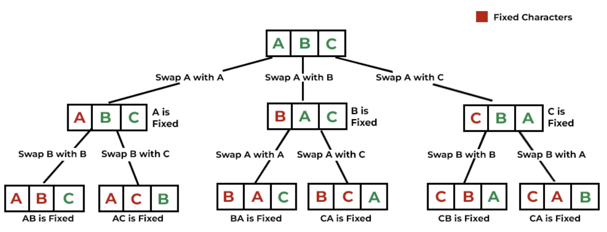
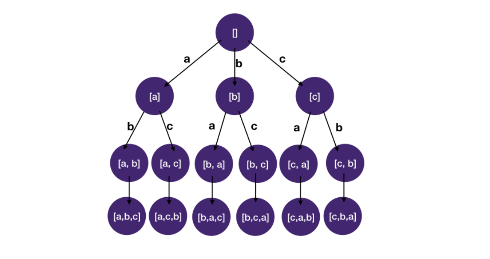
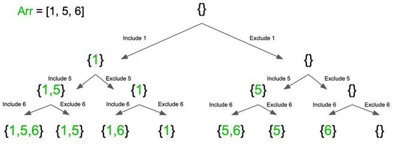

<div style="font-size: 17px;background: black;padding: 2rem;">

Backtracking is a problem-solving algorithmic technique that involves finding a solution incrementally by trying <i>**different options**</i> and <i>**undoing**</i> them if they lead to a dead end. It is commonly used in situations where you need to explore multiple possibilities to solve a problem, like searching for a path in a maze or solving puzzles like Sudoku. When a dead end is reached, the algorithm backtracks to the previous decision point and explores a different path until a solution is found or all possibilities have been exhausted.

<u>**Steps in Backtracking**</u>

1. Start with an empty solution.
2. Make a decision: Add a new element to the current partial solution.
3. Check constraints: Validate whether the current solution satisfies the problem constraints.
4. Backtrack if invalid:
   - If the current solution is not feasible, undo the last decision and try a different option.
   - If the solution is complete and valid, record it.
5. Recurse to try other possibilities.

<h3 style="border-bottom: 2px solid white; padding-bottom: 2px; display: inline-block;">Example - 1: Finding all permutations of a string</h3>

1. Fix one character at a time, starting from the leftmost character. Like first step of recursion would be: fix index `0` with all characters of string -> then find permutations of string from `[1, s.length() - 1]` for all of them.
2. Swap the fixed character with every character to its right.
3. Recurse for the substring starting from the next position.
4. Backtrack by undoing the swaps to restore the string to its original state.

<br>

<br><br>

```c++
void backtrack(string& str, int index, vector<string>& result) {
    if (index == str.size()) {
        result.push_back(str); // Add permutation to result
        return;
    }

    for (int i = index; i < str.size(); i++) {
        swap(str[index], str[i]);       // Swap current character with the one at position i
        backtrack(str, index + 1, result); // Recurse for the next index
        swap(str[index], str[i]);       // Backtrack to restore the original string
    }
}
```

<span style="color: OrangeRed;">This approach will give duplicate permutations if duplicate elements are there!</span>

<h3 style="border-bottom: 2px solid white; padding-bottom: 2px; display: inline-block;"><a href="https://www.youtube.com/watch?v=qhBVWf0YafA&ab_channel=NeetCode">Example - 2: Distinct Permutations with duplicates!</a></h3>

<br>

<br><br>

```c++
class Solution {
    vector<vector<int>> res;
    unordered_map<int, int> uom;
    vector<int> path;

    void dfs(vector<int>& v, int n) {
        if (path.size() == n) {
            res.push_back(path);
            return;
        }
        for (auto it = uom.begin(); it != uom.end(); it++) {
            if (it->second == 0) continue;
            path.push_back(it->first);
            it->second--;
            dfs(v, n);
            it->second++;
            path.pop_back();
        }
    }

public:
    vector<vector<int>> permuteUnique(vector<int>& v) {
        int n = v.size();
        for (int i = 0; i < n; i++)
            uom[v[i]]++;
        dfs(v, n);
        return res;
    }
};
```

<br>

<h3 style="border-bottom: 2px solid white; padding-bottom: 2px; display: inline-block;">Example - 3: Printing all subsets</h3>

<br>

<br><br>

- It starts with an empty subset and adds it to the result list.
- It iterates through the elements of the input vector:
  - Includes the current element in the subset.
  - Recursively calls itself with the updated subset and the next index.
  - Excludes the current element from the subset (backtracks).

```c++
void generateSubsets(int index, vector<int>& currentSubset, const vector<int>& array, vector<vector<int>>& result) {
    // Base case: if index reaches the size of the array
    if (index == array.size()) {
        result.push_back(currentSubset);
        return;
    }

    currentSubset.push_back(array[index]); // Include the current element
    generateSubsets(index + 1, currentSubset, array, result);

    currentSubset.pop_back(); // Exclude the current element (backtrack)
    generateSubsets(index + 1, currentSubset, array, result);
}
```

<hr>

<br>

<br>

## CRUCIAL POINTS TO REMEMBER:

1. Draw diagrams like image shown in "printing all subsets" question!

## IMPORTANT QUESTIONS LINK:

1. <a href="https://leetcode.com/problems/non-decreasing-subsequences/">Print all non decreasing subsequences</a>
2. <a href="https://leetcode.com/problems/partition-to-k-equal-sum-subsets">Partition to k subsets of equal sum</a> ---> <a href="https://www.youtube.com/watch?v=mBk4I0X46oI&ab_channel=NeetCode">Video</a> 🌟
3. <a href="https://leetcode.com/problems/combination-sum">Combination sum 1</a>
4. <a href="https://leetcode.com/problems/combination-sum-ii">Combination sum 2</a>: Similar to Q-1
5. <a href="https://leetcode.com/problems/combination-sum-iii">Combination sum 3</a>: Easy One!
6. <a href="https://leetcode.com/problems/split-array-into-fibonacci-sequence/">Split Array into Fibonacci Sequence</a> : Same Pattern Questions:
   - (1) <a href="https://leetcode.com/problems/palindrome-partitioning/">Palindrome Partition</a> (2) <a href="https://leetcode.com/problems/split-a-string-into-the-max-number-of-unique-substrings">Max Unique Substrings</a> (3) <a href="https://leetcode.com/problems/partition-string-into-minimum-beautiful-substrings">Min Beauty Strings</a> (4) <a href="https://leetcode.com/problems/splitting-a-string-into-descending-consecutive-values">Decreasing Consecutive Vals</a>
7. <a href="https://leetcode.com/problems/path-with-maximum-gold">Maximum gold path</a>: Easy one!
8. <a href="https://leetcode.com/problems/subsets-ii">Unique Subsets</a> Exactly like Q-4
9. <a href="https://leetcode.com/problems/letter-tile-possibilities">Unique permutations using any number of letters</a>
10. <a href="https://leetcode.com/problems/beautiful-arrangement">Beautiful arrangement</a>: Kind of like unique permutations only!
11. <a href="https://leetcode.com/problems/maximum-length-of-a-concatenated-string-with-unique-characters">String concatenation</a> : Easy but check if DP is applicable here!
12. <a href="https://leetcode.com/problems/minimum-number-of-work-sessions-to-finish-the-tasks/">Divide given array in minimum no. of subsets, such that each subset has max value of K</a> : To-Do (seems tough one! Similar Question - <a href="https://leetcode.com/problems/fair-distribution-of-cookies/">Link</a>)
13. <a href="https://leetcode.com/problems/the-number-of-beautiful-subsets">Number of beautiful subsets</a> : Easy
14. <a href="https://leetcode.com/problems/next-greater-numerically-balanced-number">Next Greater Numerically Balanced</a> : To-Do
15. <a href="https://leetcode.com/problems/maximum-product-of-the-length-of-two-palindromic-subsequences">Max product of 2 disjoint palindrome subsequences</a>
16. <a href="https://leetcode.com/problems/word-search">Word search</a>
17. <a href="https://leetcode.com/problems/restore-ip-addresses">Restore IP Address</a>

</div>