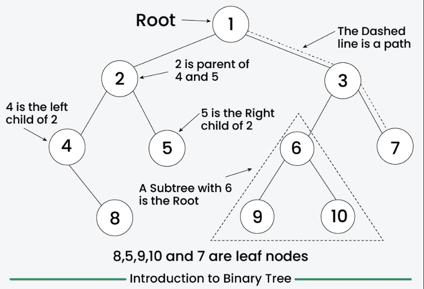
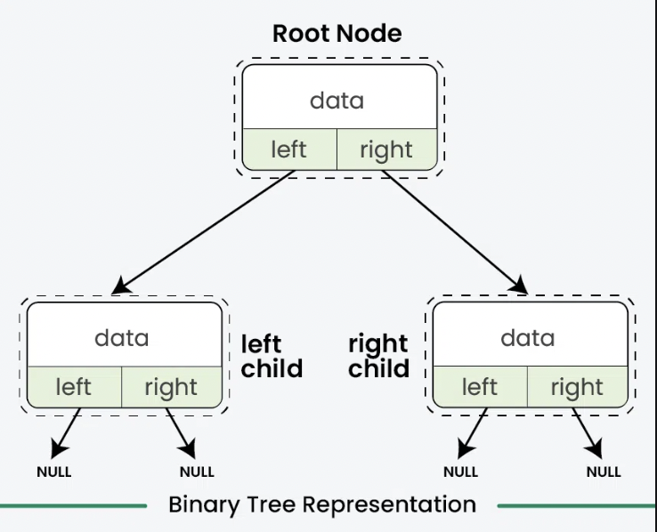
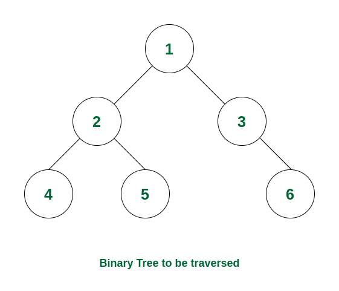

<div style="font-size: 17px;background: black;padding: 2rem;">

A Binary Tree Data Structure is a hierarchical data structure in which each node has at most two children, referred to as the left child and the right child. It is commonly used in computer science for efficient storage and retrieval of data, with various operations such as insertion, deletion, and traversal.

Each node in a Binary Tree has three parts:

- Data
- Pointer to the left child
- Pointer to the right child

<br>


<br><br>

```c++
#include <iostream>
using namespace std;

struct Node{
    int data;
    Node *left, *right;
    Node(int d){
        data = d;
        left = nullptr;
        right = nullptr;
    }
};

int main(){
    // Initilize and allocate memory for tree nodes
    Node* firstNode = new Node(2);
    Node* secondNode = new Node(3);
    Node* thirdNode = new Node(4);
    Node* fourthNode = new Node(5);

    // Connect binary tree nodes
    firstNode->left = secondNode;
    firstNode->right = thirdNode;
    secondNode->left = fourthNode;
    return 0;
}
```

<h3 style="border-bottom: 2px solid white; padding-bottom: 2px; display: inline-block;">Terminologies in Binary Tree</h3>

- <span style="color: Salmon;">Nodes:</span> The fundamental part of a binary tree, where each node contains data and link to two child nodes.
- <span style="color: Salmon;">Root:</span> The topmost node in a tree is known as the root node. It has no parent and serves as the starting point for all nodes in the tree.
- <span style="color: Salmon;">Parent Node:</span> A node that has one or more child nodes. In a binary tree, each node can have at most two children.
- <span style="color: Salmon;">Child Node:</span> A node that is a descendant of another node (its parent).
- <span style="color: Salmon;">Leaf Node:</span> A node that does not have any children or both children are null.
- <span style="color: Salmon;">Internal Node:</span> A node that has at least one child. This includes all nodes except the root and the leaf nodes.
- <span style="color: Salmon;">Depth of a Node:</span> The number of edges from a specific node to the root node. The depth of the root node is zero.
- <span style="color: Salmon;">Height of a Binary Tree:</span> The number of nodes from the deepest leaf node to the root node.

<h3 style="border-bottom: 2px solid white; padding-bottom: 2px; display: inline-block;">Properties of Binary Tree</h3>

- The maximum number of nodes at level `L` of a binary tree is `2L`.
- The maximum number of nodes in a binary tree of height `H` is `2H – 1`.
- Total number of leaf nodes in a binary tree = total number of nodes with 2 children + 1
- In a Binary Tree with N nodes, the minimum possible height or the minimum number of levels is `Log2(N+1)`
- A Binary Tree with `L` leaves has at least `| Log2L |+ 1` levels.

<br>

# Basic Operations

<h3 style="border-bottom: 2px solid white; padding-bottom: 2px; display: inline-block;">Inorder Traversal</h3>

Inorder traversal is defined as a type of tree traversal technique which follows the Left-Root-Right pattern, such that:

- The left subtree is traversed first
- Then the root node for that subtree is traversed
- Finally, the right subtree is traversed

<br>

<br><br>

```c++
void printInorder(struct Node* node) {
    if (node == nullptr) return;
    printInorder(node->left);
    cout << node->data << " ";
    printInorder(node->right);
}
```

<h3 style="border-bottom: 2px solid white; padding-bottom: 2px; display: inline-block;">Preorder Traversal</h3>

Preorder traversal is defined as a type of tree traversal that follows the Root-Left-Right policy where:

- The root node of the subtree is visited first.
- Then the left subtree is traversed.
- At last, the right subtree is traversed.

<br>

<br><br>

```c++
void printPreorder(struct Node* node) {
    if (node == nullptr) return;
    cout << node->data << " ";
    printPreorder(node->left);
    printPreorder(node->right);
}
```

<h3 style="border-bottom: 2px solid white; padding-bottom: 2px; display: inline-block;">Postorder Traversal</h3>

Postorder traversal is defined as a type of tree traversal which follows the Left-Right-Root policy such that for each node:

- The left subtree is traversed first
- Then the right subtree is traversed
- Finally, the root node of the subtree is traversed

<br>

<br><br>

```c++
void printPostorder(struct Node* node) {
    if (node == nullptr) return;
    printPostorder(node->left);
    printPostorder(node->right);
    cout << node->data << " ";
}
```

<h3 style="border-bottom: 2px solid white; padding-bottom: 2px; display: inline-block;">Level Order Traversal (Breadth First Search or BFS) of Binary Tree</h3>

Level Order Traversal technique is defined as a method to traverse a Tree such that all nodes present in the same level are traversed completely before traversing the next level.

The main idea of level order traversal is to traverse all the nodes of a lower level before moving to any of the nodes of a higher level. This can be done in any of the following ways:

1. The naive one: Find height of tree. Then for each level, run a recursive function by maintaining current height. Whenever the level of a node matches, print that node.
   - Time Complexity: O(N^2), where N is the number of nodes in the skewed tree.
   - Auxiliary Space: O(N) recursion stack space used is O(N).
2. Efficiently using a Queue.
    - Time Complexity: O(N) where N is the number of nodes in the binary tree.
    - Auxiliary Space: O(N) where N is the number of nodes in the binary tree.

```c++
// Method - 1

void printCurrentLevel(Node* root, int level);
int height(Node* node);

void printLevelOrder(Node* root) {
    int h = height(root);
    for (int i = 1; i <= h; i++) printCurrentLevel(root, i);
}

void printCurrentLevel(Node* root, int level) {
    if (root == nullptr) return;
    if (level == 1) cout << root->data << " ";
    else if (level > 1) {
        printCurrentLevel(root->left, level - 1);
        printCurrentLevel(root->right, level - 1);
    }
}

int height(Node* node) {
    if (node == nullptr) return 0;
    else {
        int lheight = height(node->left);
        int rheight = height(node->right);
        return (lheight > rheight) ? (lheight + 1) : (rheight + 1);
    }
}
```

```c++
// Method - 2

void printLevelOrder(Node* root) {
    if (root == nullptr) return;
    queue<Node*> q;
    q.push(root);

    while (q.empty() == false) {
        // Print front of queue and remove it from queue
        Node* node = q.front();
        cout << node->data << " ";
        q.pop();

        // Enqueue left child
        if (node->left != nullptr)q.push(node->left);

        // Enqueue right child
        if (node->right != nullptr) q.push(node->right);
    }
}
```

<h3 style="border-bottom: 2px solid white; padding-bottom: 2px; display: inline-block;">Height of tree</h3>

```c++
int height(Node *root) {
    if (root == nullptr) return -1;
    int lHeight = height(root->left);
    int rHeight = height(root->right);
    return max(lHeight, rHeight) + 1;
}
```


- https://leetcode.com/problems/diameter-of-binary-tree
- https://leetcode.com/problems/symmetric-tree 
- https://leetcode.com/problems/invert-binary-tree 
- https://leetcode.com/problems/validate-binary-search-tree 
- https://leetcode.com/problems/binary-tree-level-order-traversal-ii
- https://leetcode.com/problems/binary-tree-zigzag-level-order-traversal/
- https://leetcode.com/problems/lowest-common-ancestor-of-a-binary-tree/
- https://leetcode.com/problems/lowest-common-ancestor-of-a-binary-search-tree/
- https://leetcode.com/problems/populating-next-right-pointers-in-each-node
- https://leetcode.com/problems/binary-tree-right-side-view
- https://leetcode.com/problems/deepest-leaves-sum 
- https://leetcode.com/problems/reverse-odd-levels-of-binary-tree
- https://leetcode.com/problems/maximum-difference-between-node-and-ancestor
- https://leetcode.com/problems/lowest-common-ancestor-of-deepest-leaves 🌟

</div>
