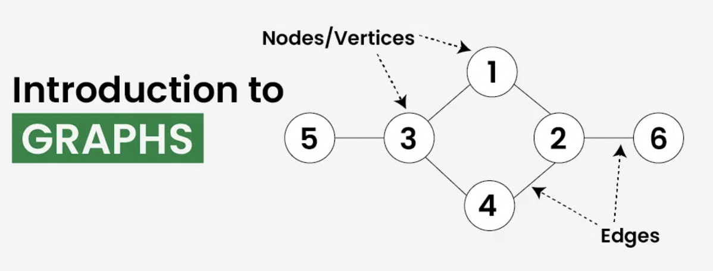
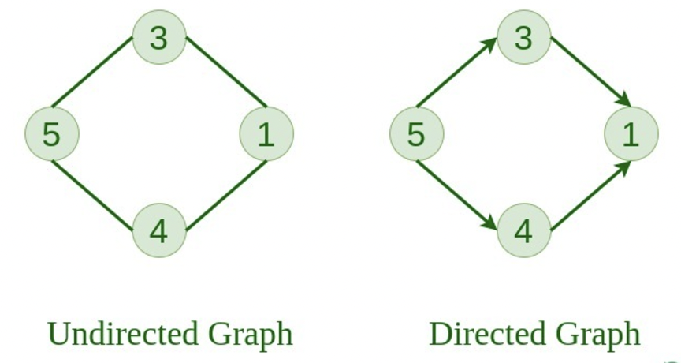
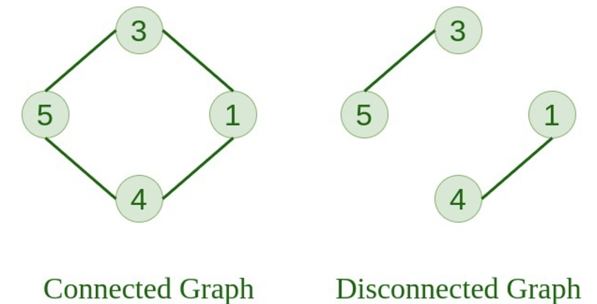
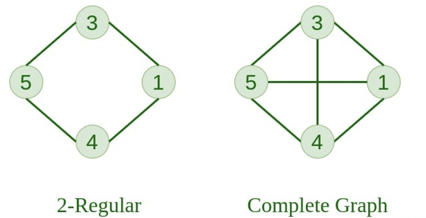
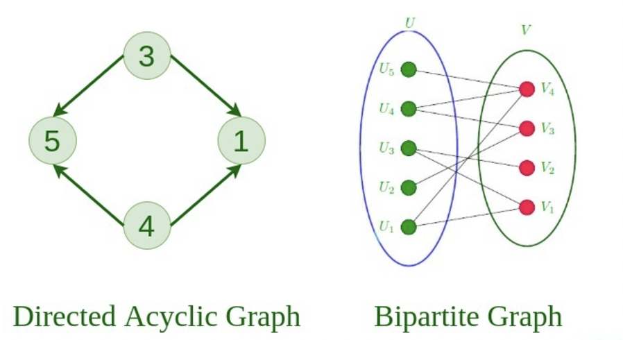
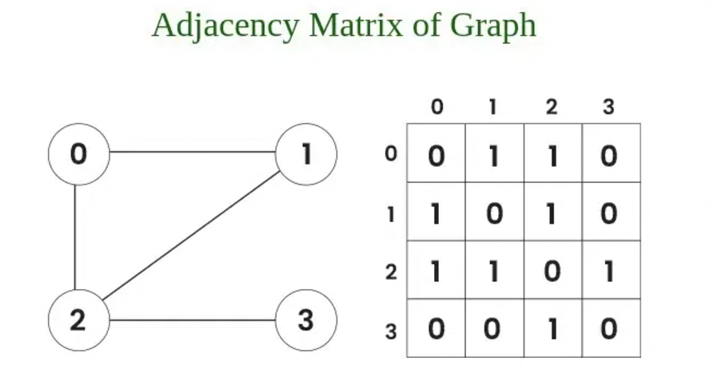
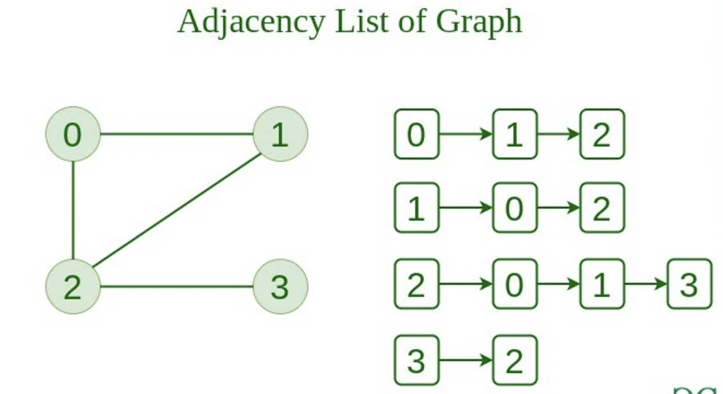

<div style="font-size: 17px;background: black;padding: 2rem;">

A graph is a non-linear data structure that consists of a set of vertices/nodes (V) and a set of edges (E) that connect pairs of vertices. It is widely used to model relationships and connections, such as social networks, transportation routes, and computer networks. The graph is denoted by **G(V, E)**.

<br>

<br><br>

Imagine a game of football as a web of connections, where players are the nodes and their interactions on the field are the edges. This web of connections is exactly what a graph data structure represents, and it’s the key to unlocking insights into team performance and player dynamics in sports.

<h3 style="border-bottom: 2px solid white; padding-bottom: 2px; display: inline-block;">Types of Graphs</h3>

<b style="color:DarkSalmon;">1. Null Graph: </b> A graph is known as a null graph if there are no edges in it.

<b style="color:DarkSalmon;">2. Trivial Graph: </b> Graph having only a single vertex, it is also the smallest graph possible.

<b style="color:DarkSalmon;">3. Undirected Graph: </b> A graph in which edges do not have any direction. That is the nodes are unordered pairs in the definition of every edge.

<b style="color:DarkSalmon;">4. Directed Graph: </b> A graph in which edge has direction. That is the nodes are ordered pairs in the definition of every edge.

<br>

<br><br>

<b style="color:DarkSalmon;">5. Connected Graph:</b> The graph in which from one node we can visit any other node in the graph is known as a connected graph.

<b style="color:DarkSalmon;">6. Disconnected Graph:</b> The graph in which at least one node is not reachable from a node is known as a disconnected graph.

<br>

<br><br>

<b style="color:DarkSalmon;">7. Regular Graph:</b> The graph in which the degree of every vertex is equal to `K` is called `K regular graph`.

<b style="color:DarkSalmon;">8. Complete Graph:</b> The graph in which from each node there is an edge to each other node.

<br>

<br><br>

<b style="color:DarkSalmon;">9. Cycle Graph:</b> The graph in which the graph is a cycle in itself, the minimum value of degree of each vertex is 2.

<b style="color:DarkSalmon;">10. Cyclic Graph:</b> A graph containing at least one cycle is known as a Cyclic graph.

<br>

<br><br>

<b style="color:DarkSalmon;">11. Directed Acyclic Graph:</b> A Directed Graph that does not contain any cycle.

<b style="color:DarkSalmon;">12. Bipartite Graph:</b> A graph in which vertex can be divided into two sets such that vertex in each set does not contain any edge between them.

- <span style="color: Crimson;">NOTE:</span> Even disconnected graphs can also be bipartite. Requirement is just that either of the 2 sets should not contain an edge connecting themselves.

<br>

<br><br>

<b style="color:DarkSalmon;">13. Weighted Graph:</b>

- A graph in which the edges are already specified with suitable weight is known as a weighted graph.
- Weighted graphs can be further classified as directed weighted graphs and undirected weighted graphs.

<b style="color:DarkSalmon;">14. Sparse Graph:</b> A sparse graph is a graph with a small number of edges, significantly less than the maximum number of edges possible.

<b style="color:DarkSalmon;">15. Dense Graph:</b> A dense graph is a graph in which the number of edges is close to the maximal number of edges

<h3 style="border-bottom: 2px solid white; padding-bottom: 2px; display: inline-block;">Some Terminologies</h3>

<b style="color:Violet;">1. Degree of a vertex:</b> The degree of a vertex in a graph is the number of edges incident to that vertex. In a directed graph, the indegree of a vertex is the number of incoming edges, and the outdegree is the number of outgoing edges.

<b style="color:Violet;">2. Path:</b> A path in a graph is a sequence of vertices connected by edges. The length of a path is the number of edges it contains.

<b style="color:Violet;">3. Spanning trees and Minimum Spanning Trees (MST):</b> A spanning tree of a graph is a subgraph that is a tree and includes all the vertices of the original graph. A minimum spanning tree (MST) is a spanning tree with the minimum possible sum of edge weights.

<b style="color:Violet;">4. Hamiltonian Path:</b> A path that visits every vertex exactly once. A Hamiltonian path that starts and ends at the same vertex is called `Hamiltonian Circuit`.

<b style="color:Violet;">5. Eulerian Path:</b> A path that visits every edge exactly once. A Eulerian path that starts and ends at the same vertex is called `Eulerian Circuit`.

<b style="color:Violet;">6. Subgraph:</b> A graph formed from a subset of vertices and edges of a larger graph.

<b style="color:Violet;">7. Transpose Graph:</b> Transpose of a directed graph `G` is another directed graph on the same set of vertices with all of the edges reversed compared to the orientation of the corresponding edges in `G`.

<h3 style="border-bottom: 2px solid white; padding-bottom: 2px; display: inline-block;">Applications of graph</h3>

- Used heavily in social networks. Everyone on the network is a vertex (or node) of the graph and if connected, then there is an edge. Now imagine all the features that you see, mutual friends, people that follow you, etc can seen as graph problems.
- Used to represent the topology of computer networks, such as the connections between routers and switches.
- Used to represent the connections between different places in a transportation network, such as roads and airports.
- Neural Networks: Vertices represent neurons and edges represent the synapses between them. Neural networks are used to understand how our brain works and how connections change when we learn. The human brain has about 10^11 neurons and close to 10^15 synapses.
- Compilers: Graph Data Structure is used extensively in compilers. They can be used for type inference, for so-called data flow analysis, register allocation, and many other purposes. They are also used in specialized compilers, such as query optimization in database languages.
- Robot planning: Vertices represent states the robot can be in and the edges the possible transitions between the states. Such graph plans are used, for example, in planning paths for autonomous vehicles.
- For optimizing the cost of connecting all locations of a network. For example, minimizing wire length in a wired network to make sure all devices are connected is a standard Graph problem called Minimum Spanning Tree.

<br>

# Representation of Graph Data Structure

There are multiple ways to store a graph: The following are the most common representations.

- Adjacency Matrix
- Adjacency List

<h3 style="border-bottom: 2px solid white; padding-bottom: 2px; display: inline-block;">Adjacency Matrix Representation of Graph Data Structure:</h3>

In this method, the graph is stored in the form of the 2D matrix where rows and columns denote vertices. Each entry in the matrix represents the weight of the edge between those vertices.

<br>

<br><br>

<h3 style="border-bottom: 2px solid white; padding-bottom: 2px; display: inline-block;">Adjacency List Representation of Graph:</h3>

This graph is represented as a collection of linked lists. There is an array of pointer which points to the edges connected to that vertex.

<br>

<br><br>

```c++
#include <bits/stdc++.h>
using namespace std;

class GraphList {
private:
    vector<vector<pair<int, int>>> adjList;  // Pair to store (neighbor, weight)
    int numVertices;

public:
    GraphList(int vertices) : numVertices(vertices) {
        adjList.resize(vertices);
    }

    void addEdge(int u, int v, int weight = 1) {
        adjList[u].push_back({v, weight});  // Directed edge
    }

    void printGraph() {
        for (int i = 0; i < numVertices; i++) {
            cout << "Vertex " << i << ":";
            for (auto edge : adjList[i])
                cout << " -> (" << edge.first << ", " << edge.second << ")";
            cout << endl;
        }
    }
};

int main() {
    GraphList graph(4);
    graph.addEdge(0, 1, 2);
    graph.addEdge(1, 2, 3);
    graph.addEdge(2, 3, 4);
    graph.printGraph();
    return 0;
}
```

<br>

# Breadth First Search (BFS)

Breadth-First Search (BFS) is a graph traversal algorithm that explores vertices level by level. Starting from a given source vertex, BFS visits all the vertices at the current depth before moving on to the vertices at the next depth level. It uses a queue to keep track of the vertices to visit next, ensuring a breadth-first traversal.

<h3 style="border-bottom: 2px solid white; padding-bottom: 2px; display: inline-block;">BFS of connected graph (from a source)</h3>

The algorithm starts from a given source and explores all reachable vertices from the given source. It is similar to the Breadth-First Traversal of a tree. Like tree, we begin with the given source (in tree, we begin with root) and traverse vertices level by level using a queue data structure. The only catch here is that, unlike trees, graphs may contain cycles, so we may come to the same node again. To avoid processing a node more than once, we use a boolean visited array.

1. Initialize a visited array to keep track of visited vertices.
2. Create a queue and enqueue the starting vertex.
3. Mark the starting vertex as visited.
4. While the queue is not empty:
   - Dequeue the front vertex.
   - For each neighbor of the dequeued vertex:
     - If the neighbor is not visited:
       - Mark it as visited.
       - Enqueue it.

```
Time Complexity: O(V+E), where V is the number of nodes and E is the number of edges.
Auxiliary Space: O(V)
```

```c++
void bfs(vector<vector<int>>& adj, int s) { // adj -> adjacency list representation!
    queue<int> q;
    vector<bool> visited(adj.size(), false);

    visited[s] = true;
    q.push(s);

    while (!q.empty()) {
        int curr = q.front();
        q.pop();

        cout << curr << " ";

        for (int x : adj[curr]) {
            if (!visited[x]) {
                visited[x] = true;
                q.push(x);
            }
        }
    }
}
```

<h3 style="border-bottom: 2px solid white; padding-bottom: 2px; display: inline-block;">BFS of whole graph which may be disconnected</h3>

The above implementation takes a source as an input and prints only those vertices that are reachable from the source and would not print all vertices in case of disconnected graph. The only way to do this is instead of calling BFS for a single vertex, we call the above implemented BFS for all all non-visited vertices one by one.

```
Time Complexity: O(V+E), where V is the number of nodes and E is the number of edges.
Auxiliary Space: O(V)
```

```c++
void bfsDisconnected(vector<vector<int>>& adj) {
    vector<bool> visited(adj.size(), false);
    for (int i = 0; i < adj.size(); ++i) {
        if (!visited[i]) {
            bfs(adj, i, visited);
        }
    }
}

void bfs(vector<vector<int>>& adj, int s, vector<bool>& visited) {
 //...above bfs code
}
```

<br>

# Depth First Search (DFS)

Depth-First Search (DFS) is a graph traversal algorithm that explores as far as possible along each branch before backtracking. This is similar to a tree, where we first completely traverse the left subtree and then move to the right subtree. The key difference is that, unlike trees, graphs may contain cycles (a node may be visited more than once). To avoid processing a node multiple times, we use a boolean visited array.

<b><u>Working:</u></b>

1. Start at the source vertex.
2. Visit the current vertex and mark it as visited.
3. Recursively explore all its unvisited neighbors.
4. Backtrack when no unvisited neighbors remain.

<b><u>DFS can be implemented using:</u></b>

1. Recursion (natural stack mechanism of the function call stack).
2. Explicit Stack for an iterative approach.

```c++
// Recursive Traversal

void dfsUtil(int vertex, vector<bool>& visited) {
    visited[vertex] = true; // Mark the vertex as visited

    cout << vertex << " ";

    for (int neighbor : adjList[vertex])
        if (!visited[neighbor])
            dfsUtil(neighbor, visited); // Recursively visit unvisited neighbors
}


void dfs(vector<vector<int>> &adjList, int start) {
    int n = adjList.size();
    vector<bool> visited(n, false);
     dfsUtil(adjList, start, visited);
}
```

Time Complexity:

- Adjacency List: O(V+E), where V is the number of vertices and E is the number of edges.
- Adjacency Matrix: O(V<sup>2</sup>) due to the nested loops required to check adjacency.

Space Complexity:

- O(V) for the `visited` array and recursive stack (or explicit stack in the iterative version).

<span style="color: Orange;">NOTE:</span> If DFS traversal of entire graph is needed for disconnected graphs, instead of calling DFS for a single vertex, we call the above implemented DFS for all all non-visited vertices one by one.

<h3 style="border: 2px solid white; padding: 2px 10px; display: inline-block;">DFS vs BFS</h3>

<b><u>When DFS is preferred!</u></b>

1. <span style="color: Lime;">Exploring All Paths or Backtracking Problems:</span>

   - DFS is ideal for problems that require exploring all possible solutions or paths, such as:
     - Maze-solving
     - N-Queens problem
     - Sudoku solver
     - Word search in a matrix
   - Its recursive nature makes it well-suited for problems involving backtracking.

2. <span style="color: Lime;">Low-Latency Search in Deep Graphs:</span>

   - When a solution exists deep in the graph, DFS is faster than BFS since it explores deeper levels quickly rather than exhaustively traversing each level.

3. <span style="color: Lime;">Longer Path Exploration:</span>

   - If the goal is to explore longer paths or check for specific properties in deeper parts of the graph (e.g., checking for Hamiltonian paths), DFS is a natural choice.

4. <span style="color: Lime;">Cycle Detection:</span>

   - DFS is preferred for detecting cycles in both directed and undirected graphs since it naturally keeps track of recursion stacks and visited nodes.

5. <span style="color: Lime;">Topological Sorting:</span>

   - In Directed Acyclic Graphs (DAGs), DFS is the backbone of topological sorting algorithms, as it can determine the order of tasks based on dependencies.

<b><u>When BFS is preferred!</u></b>

1. <span style="color: Lime;">Finding the Shortest Path in Unweighted Graphs:</span>

   - BFS guarantees finding the shortest path (minimum number of edges) between a source vertex and a target vertex in an unweighted graph because it explores all vertices at the current depth level before moving deeper.
   - Example: Shortest path in a maze or a network.

2. <span style="color: Lime;">Checking Bipartite Graphs:</span>

   - BFS is the go-to algorithm for checking whether a graph is bipartite by coloring the graph level by level. It ensures two-coloring constraints are maintained.

3. <span style="color: Lime;">Multi-Source Problems:</span>

   - BFS can be adapted to solve problems involving multiple starting points by initializing the queue with all sources simultaneously.
   - Example: Multi-source shortest path problems.

4. <span style="color: Lime;">Reach somewhere in fixed amound of steps</span>

<br>

# Some Applications of DFS and BFS

<h3 style="border-bottom: 2px solid white; padding-bottom: 2px; display: inline-block;">1. Cycle Detection in directed graph</h3>

A cycle in a directed graph occurs when there is a path that starts and ends at the same vertex. Detecting cycles is crucial for applications like verifying if a graph is a Directed Acyclic Graph (DAG), deadlock detection and dependency resolution.

<b><u>Method-1: DFS Method</u></b>

To find cycle in a directed graph we can use the Depth First Traversal (DFS) technique. It is based on the idea that there is a cycle in a graph only if there is a back edge [i.e., a node points to one of its ancestors in a DFS tree] present in the graph. To detect a back edge, we need to keep track of the visited nodes that are in the current recursion stack [i.e., the current path that we are visiting]. Please note that all ancestors of a node are present in recursion call stack during DFS. So if there is an edge to an ancestor in DFS, then this is a back edge.

Note: If the graph is disconnected then get the DFS forest and check for a cycle in individual graphs by checking back edges.

**Steps:**

1. Maintain a visited array to track visited nodes.
2. Maintain a recStack (recursion stack) to track the nodes currently in the DFS recursion.
3. If during the DFS, you revisit a node that is already in the recStack, a cycle is detected.

```c++
bool dfs(int node, vector<vector<int>> &adj, vector<bool> &visited, vector<bool> &recStack) {
    visited[node] = true;
    recStack[node] = true;

    for (int neighbor : adj[node])
        if (!visited[neighbor]) {
            if (dfs(neighbor, adj, visited, recStack))
                return true; // Cycle detected
        } else if (recStack[neighbor])
            return true; // Cycle detected

    recStack[node] = false; // Backtracking
    return false;
}

bool isCyclicDFS(int V, vector<vector<int>> &adj) {
    vector<bool> visited(V, false);
    vector<bool> recStack(V, false);

    for (int i = 0; i < V; i++)
        if (!visited[i])
            if (dfs(i, adj, visited, recStack))
                return true; // Cycle detected

    return false; // No cycle
}
```

```
Time Complexity: O(V + E)
Space Complexity: O(V) (for recursion stack and recStack array)
```

<b><u>Method-2: BFS Method</u></b>

[DESCRIBED BELOW IN KAHN'S METHOD OF FINDING TOPOLOGICAL SORTING]

<h3 style="border-bottom: 2px solid white; padding-bottom: 2px; display: inline-block;">2. Topological Sorting</h3>

Topological sorting of a Directed Acyclic Graph (DAG) is a linear ordering of its vertices such that for every directed edge `(u, v)`, vertex `u` appears before vertex `v` in the ordering. <span style="color: Magenta;">Topological sorting is only possible for Directed Acyclic Graphs (DAGs)</span>, as the presence of cycles would make it impossible to define a valid ordering. There may be multiple valid topological orders for a single graph.

```
For edges: 0 -> 2   0 -> 3   1 -> 3   1 -> 4   3 -> 5   4 -> 5

Topological Order: 0 1 2 3 4 5
```

**Applications of Topological Sorting:**

- Task Scheduling: When tasks have dependencies, topological sorting determines the sequence of execution.
- Build Systems: Determines the order in which components must be built.
- Dependency Resolution: Resolves dependencies in package managers.
- Course Prerequisites: Finds an order to take courses given their prerequisites.

We can find this ordering using both DFS and BFS:

<b><u style="color: deepskyblue;"><a href="https://www.youtube.com/watch?v=73sneFXuTEg&ab_channel=takeUforward">Method-1: Kahn's Algorithm (Using BFS)</a></u></b>

1. In-degree:
   - The in-degree of a vertex is the number of edges directed into it.
   - Kahn's algorithm uses in-degrees to determine which vertices have no dependencies (in-degree of `0`).
2. Queue: A queue is used to process vertices with an in-degree of `0`, which can be added to the topological order.
3. Process Vertices:
   - For each vertex removed from the queue:
     - Add it to the topological order.
     - Reduce the in-degree of its adjacent vertices.
     - If any vertex’s in-degree becomes `0`, add it to the queue.
4. Cycle Detection: If all vertices are not processed and the queue becomes empty, the graph contains a cycle and no topological order exists.

```c++
vector<int> topologicalSort(int V, vector<vector<int>> &adj) {
    vector<int> inDegree(V, 0);
    vector<int> topoOrder;

    // Calculate in-degree for each vertex
    for (int u = 0; u < V; u++)
        for (int v : adj[u])
            inDegree[v]++;

    // Enqueue all vertices with in-degree 0
    queue<int> q;
    for (int i = 0; i < V; i++)
        if (inDegree[i] == 0)
            q.push(i);

    // Process vertices in the queue
    while (!q.empty()) {
        int node = q.front();
        q.pop();
        topoOrder.push_back(node);

        // Reduce in-degree of adjacent vertices
        for (int neighbor : adj[node]) {
            inDegree[neighbor]--;
            if (inDegree[neighbor] == 0)
                q.push(neighbor);
        }
    }

    if (topoOrder.size() != V) // Check if a valid topological sort exists
        throw runtime_error("The graph contains a cycle and cannot be topologically sorted.");

    return topoOrder;
}
```

```
Time Complexity: O(V + E)
Space Complexity: O(V + E)
```

<b><u>Method-2: DFS Method</u></b>

A vertex is pushed to the stack only after all its adjacent vertices are visited (postorder traversal). Finally, the stack contains the topological order in reverse.

```c++
void dfs(int node, vector<vector<int>> &adj, vector<bool> &visited, stack<int> &stk) {
    visited[node] = true;

    for (int neighbor : adj[node])
        if (!visited[neighbor])
            dfs(neighbor, adj, visited, stk);

    stk.push(node);
}

vector<int> topologicalSortDFS(int V, vector<vector<int>> &adj) {
    vector<bool> visited(V, false);
    stack<int> stk;

    for (int i = 0; i < V; i++)
        if (!visited[i])
            dfs(i, adj, visited, stk);

    vector<int> topoOrder;
    while (!stk.empty()) {
        topoOrder.push_back(stk.top());
        stk.pop();
    }

    return topoOrder;
}
```

```
Time Complexity: O(V + E)
Space Complexity: O(V)
```

<span style="color: Crimson;">We can maintain an array of ancestors here also just to detect if cycle is present or not! Won't be able to return the boolean value like above case, but that can be stored in an external variable!</span>

<h3 style="border-bottom: 2px solid white; padding-bottom: 2px; display: inline-block;">3. Finding all possible between 2 nodes</h3>

To find all possible paths between two nodes in a graph, you can use Depth-First Search (DFS) to traverse the graph while keeping track of the path.

**<u>WORKING</u>**

1. Graph Representation:
    - Represent the graph using an adjacency list.
    - This makes traversal efficient and flexible for both directed and undirected graphs.

2. Recursive DFS:
    - Start from the source node.
    - Keep a visited array to avoid revisiting nodes in the current path.
    - Maintain a path vector to store the current path.
    - If you reach the destination node, save the current path.

3. Backtracking:
    - After exploring all paths from a node, backtrack by removing the node from the current path and marking it as unvisited.

```c++
vector<bool> visited;
vector<int> path;
vector<vector<int>> allPaths;
vector<vector<int>> graph;

void findPaths(int node) {
    visited[node] = true;  // Mark the current node as visited
    path.push_back(node);  // Add the current node to the path

    if (node == destination) {
        allPaths.push_back(path);  // If destination is reached, store the path
    } else {
        // Recur for all neighbors of the current node
        for (int neighbor : graph[node])
            if (!visited[neighbor]) 
                findPaths(neighbor, destination, graph, path, allPaths);
    }

    // Backtrack: Unmark the current node and remove it from the path
    visited[node] = false;
    path.pop_back();
}

vector<vector<int>> allPathsBetweenNodes(int n, vector<vector<int>>& edges, int source, int destination) {
    graph.resize(n);  // Adjacency list representation

    for (auto& edge : edges) graph[edge[0]].push_back(edge[1]);  // Directed edge

    visited.resize(n, false);

    findPaths(source, destination, graph, visited, path, allPaths);

    return allPaths;
}
```

```
Time Complexity: O(V + E)
Space Complexity: O(V)
```

<br>

# Minimum Spanning Tree

Spanning Tree is a subgraph that connects all vertices of the graph without forming cycles. Here are the properties of a spanning tree:

- There is a fixed number of edges in the spanning tree which is equal to one less than the total number of vertices ( `E = V-1` ). It's not possible to make a graph with `V` nodes and more than `V-1` edges without a cycle.
- The spanning tree should be **<u>connected</u>**, as in there should only be a single source of component, not more than that.
- The spanning tree should be **<u>acyclic</u>**, which means there would not be any cycle in the tree.
- The total cost (or weight) of the spanning tree is defined as the sum of the edge weights of all the edges of the spanning tree.
- There can be many possible spanning trees for a graph.

A minimum spanning tree (MST) is defined as a spanning tree that has the minimum weight among all the possible spanning trees. The 2 most popular greedy algorithms for finding MST are: <span style="color: Orange;">Kruskal's Algorithm</span> and <span style="color: HotPink;">Prim's Algorithm</span>

<h3 style="border-bottom: 2px solid white; padding-bottom: 2px; display: inline-block;">Kruskal's Algorithm</h3>

Below are the steps for finding MST using Kruskal’s algorithm:

1. Sort all the edges in non-decreasing order of their weight.
2. Pick the smallest edge. Check if it forms a cycle with the spanning tree formed so far. If the cycle is not formed, include this edge. Else, discard it.
3. Repeat step#2 until there are `(V-1)` edges in the spanning tree.

Step 2 uses the <span style="color: Cyan;">Union-Find algorithm (Disjoint-Set data structure)</span> to detect cycles.

<h4 style="border: 2px solid white; padding: 2px 10px; display: inline-block;">Union Find Algorithm</h4>

A data structure that stores non overlapping or disjoint subset of elements is called disjoint set data structure. The disjoint set data structure supports following operations:

- Adding new sets to the disjoint set.
- Merging disjoint sets to a single disjoint set using Union operation.
- Finding representative of a disjoint set using Find operation.
- Check if two sets are disjoint or not.

**<u>Operations in Disjoint Set</u>**

1. `find(x)`: Determines the representative or "root" of the set containing `x`. This is used to check if two elements belong to the same set.
2. `union(x, y)`: Merges the sets containing `x` and `y` into one.

**<u>Optimizations</u>**

To improve efficiency, two techniques are commonly used:

<b style="color:DarkKhaki;">1. Path Compression: </b>It is an optimization for the `find` operation. During this operation, instead of returning the root of the set directly, the algorithm updates the parent pointers of all nodes along the path from `x` to the root to point directly to the root. Working:

- When calling `find(x)`, if x is not the root (i.e., `parent[x] != x`), recursively find the root and make x's parent point directly to the root.
- This effectively flattens the tree, reducing its height, so future operations involving any of these nodes are faster.

```
      1
     /
    2
   /        ->        1
  3                  /|\
 /                  2 3 4
4
```

```c++
// Pseudo Code

vector<int> parent, rank; // set both sizes = n (no of nodes), value of each rank = 0 and parent of each node to self

int find(int x) {
    if (parent[x] == x) return parent[x];
    return parent[x] = find(parent[x]); // Path compression
}
```

Without Path Compression, the time complexity of a `find` operation could be proportional to the height of the tree, `O(h)`. With Path Compression, the tree height is drastically reduced over time, approaching `O(1)` (`O(log n)` in worst case) for each operation after many `find` operations.

<b style="color:DarkKhaki;">2. Union By Rank: </b> Union by Rank (or Size) is an optimization for the `union` operation. The idea is to attach the smaller tree under the larger tree to keep the tree height as small as possible.

**Rank vs. Size:**

- Rank: Represents an upper bound on the height of the tree. Initially, all nodes have a rank of 0. When two trees are merged, the rank increases only if the ranks of both trees are equal.
- Size: Represents the number of elements in the set. Instead of rank, you can attach the smaller tree to the larger tree based on the number of elements.

Both approaches achieve the same goal of minimizing tree height. Rank is slightly easier to implement because it only requires an integer value.

**Working:**

1. During a `union(x, y)` operation, find the roots of `x` and `y` (using `find`).
2. Compare the ranks of the roots:
   - Attach the smaller rank tree under the larger rank tree.
   - If the ranks are the same, arbitrarily attach one tree under the other and increase the rank of the new root.

```c++
bool unionSets(int x, int y) {
    int rootX = find(x);
    int rootY = find(y);

    if (rootX == rootY) return false; // Already in the same set

    // Union by rank
    if (rank[rootX] < rank[rootY]) {
        parent[rootX] = rootY;
    } else if (rank[rootX] > rank[rootY]) {
        parent[rootY] = rootX;
    } else {
        parent[rootY] = rootX;
        rank[rootX]++;
    }
    return true;
}
```

<br>

# Shortest Path algorithms

3 most important algorithms to find shortest paths between nodes: <span style="color: Cyan;">Dijkstra’s Algorithm</span>, <span style="color: HotPink;">Bellman-Ford Algorithm</span> and <span style="color: Violet;">Floyd-Warshall Algorithm</span>.

<h3 style="border-bottom: 2px solid white; padding-bottom: 2px; display: inline-block;">Dijkstra’s Algorithm</h3>

Dijkstra's Algorithm is a greedy algorithm used to find the shortest path from <u style="color: Salmon;">a source node</u> to all other nodes in a graph with <u style="color: DarkSalmon;">non-negative</u> edge weights.

<b><u>Working</u></b>

1. Initialization:

   - Create a distance array to store the shortest known distance from the source to each node. Initialize all distances to infinity (`INF`) except the source, which is set to `0`.
   - Use a priority queue (min-heap) to explore nodes with the smallest tentative distance first.

2. Relaxation: For the current node (extracted from the priority queue with the smallest distance), update the distances of its neighbors if a shorter path is found via the current node.

3. Termination: Repeat until all nodes have been processed or the priority queue is empty.

```c++
#include <bits/stdc++.h>
using namespace std;

vector<int> dijkstra(int V, vector<vector<pair<int, int>>>& adj, int source) {
    vector<int> distance(V, INT_MAX); // Initialize distances to INF
    priority_queue<pair<int, int>, vector<pair<int, int>>, greater<>> pq; // Min-heap

    distance[source] = 0;  // Distance to source is 0
    pq.push({0, source}); // {distance, node}

    while (!pq.empty()) {
        int node = pq.top().second;
        pq.pop();

        // Relax all neighbors
        for (auto& edge : adj[node]) {
            int neighbor = edge.first;
            int weight = edge.second;

            // Check if we found a shorter path
            if (distance[node] + weight < distance[neighbor]) {
                distance[neighbor] = distance[node] + weight;
                pq.push({distance[neighbor], neighbor}); // Push updated distance to the priority queue
            }
        }
    }

    return distance;
}
```

```
Time Complexity: O((V+E)logV), where
Space Complexity: O(V+E) for adjacency list and
```

**<u>Can we use a Queue instead of a Priority Queue?</u>** The answer to this question is yes, we can use a queue instead of Priority Queue. The only difference between a queue and a priority queue is that we have to traverse all connected nodes of a current node and find the minimum among them when we use a normal queue which takes time of `O(V)`. But using the priority queue we can optimize it to `O(log V)`. The Time Complexity of Dijkstra’s Algorithm using a normal queue is `O(V^2)`.

**<u>Why this algorithm doesn't work with negative edge weights?</u>**

The algorithm works by greedily selecting the node with the minimum distance at each step and updating the distances of its neighbors. However, negative edge weights can break this fundamental approach for two main reasons:

1. <span style="color: DeepSkyBlue;">Infinite Path Optimization:</span> When negative edge weights are present, the algorithm can get trapped in an infinite optimization cycle. Unlike positive weights, where the distance to a node eventually stabilizes, negative weights can create scenarios where repeatedly traversing a path with negative edges continually reduces the total path length. This means the algorithm can't determine a true "shortest" path because it could theoretically keep finding "shorter" paths by cycling through negative-weight edges.

2. <span style="color: DeepSkyBlue;">Violation of Greedy Choice Property:</span> Dijkstra's algorithm relies on a greedy choice property - once a node's shortest distance is determined, it's considered final and won't change. With negative weights, this assumption breaks down. A path that initially seems longer might become shorter after exploring additional negative-weight edges, invalidating previous distance calculations.

<h3 style="border-bottom: 2px solid white; padding-bottom: 2px; display: inline-block;">Bellman-Ford Algorithm</h3>

This algorithm is a single-source shortest path algorithm that works for graphs <span style="color: Cyan;">with negative weight edges</span>. It is slower than Dijkstra's algorithm but more versatile because it can handle negative weights and detect negative weight cycles.

<b><u>Working</u></b>

1. Relaxation:
   - For every edge `(u, v)` with weight `w`, if `distance[u] + w < distance[v]`, update `distance[v]` to `distance[u] + w`.
   - This ensures that the shortest known distance to each vertex is progressively improved.
2. Negative Weight Cycles:
   - After `V−1` iterations (where `V` is the number of vertices), the shortest distances should be finalized.
   - A further iteration is used to check for any distance updates. If any edge can still be relaxed, it indicates the presence of a negative weight cycle.

```c++
bool bellmanFord(int V, int E, int source, vector<Edge> &edges, vector<int> &distance) {
    // Initialize distances from source
    distance.assign(V, INT_MAX);
    distance[source] = 0;

    // Relax edges V-1 times
    for (int i = 0; i < V - 1; i++) {
        for (const Edge &edge : edges) {
            if (distance[edge.u] != INT_MAX &&
                distance[edge.u] + edge.weight < distance[edge.v]) {
                distance[edge.v] = distance[edge.u] + edge.weight;
            }
        }
    }

    // Check for negative weight cycles
    for (const Edge &edge : edges) {
        if (distance[edge.u] != INT_MAX &&
            distance[edge.u] + edge.weight < distance[edge.v]) {
            return false; // Negative weight cycle detected
        }
    }

    return true; // No negative weight cycles
}
```

```
Time Complexity: O(V⋅E)
Space Complexity: O(V) for the distance array.
```

**Why Relaxing Edges (V – 1) times gives us Single Source Shortest Path?**

A shortest path between two vertices can have at most `(V – 1)` edges. It is not possible to have a simple path with more than `(V – 1)` edges (otherwise it would form a cycle). Therefore, repeating the relaxation process `(V – 1)` times ensures that all possible paths between source and any other node have been covered.

<h3 style="border-bottom: 2px solid white; padding-bottom: 2px; display: inline-block;">Floyd Warshall Algorithm</h3>

The Floyd Warshall Algorithm is an all pair shortest path algorithm unlike Dijkstra and Bellman Ford which are single source shortest path algorithms. This algorithm works for both the directed and undirected weighted graphs. But, it does not work for the graphs with negative cycles (where the sum of the edges in a cycle is negative). It follows Dynamic Programming approach to check every possible path going via every possible node in order to calculate shortest distance between every pair of nodes.

<b><u>Working</u></b>

1. Dynamic Programming:
   - Use a distance matrix `dist[i][j]` where `dist[i][j]` represents the shortest distance from vertex `i` to vertex `j`.
   - Initially, `dist[i][j]` is set to:
     - `0` if `i == j` (distance to itself is zero),
     - Weight of the edge `(i, j)` if it exists,
     - `INF` (infinity) otherwise.
2. Relaxation via Intermediate Vertices:
   - For every vertex `k` (considered as an intermediate vertex):
     - Update `dist[i][j]` as: `dist[i][j] = min(dist[i][j], dist[i][k] + dist[k][j])`
     - This ensures that the shortest path between `i` and `j` is updated by considering paths through vertex `k`.
3. Negative Weight Cycles:
   - If `dist[i][i] < 0` for any i after running the algorithm, it indicates a negative weight cycle.

<br>

```c++
void floydWarshall(int V, vector<vector<int>> &graph) {
    // Initialize the distance matrix
    vector<vector<int>> dist(V, vector<int>(V, INT_MAX));

    // Copy the graph into the distance matrix
    for (int i = 0; i < V; i++)
        for (int j = 0; j < V; j++)
            if (i == j)
                dist[i][j] = 0; // Distance to self is 0
            else if (graph[i][j] != 0)
                dist[i][j] = graph[i][j]; // Direct edge weight

    // Run the Floyd-Warshall algorithm
    for (int k = 0; k < V; k++)
        for (int i = 0; i < V; i++)
            for (int j = 0; j < V; j++)
                if (dist[i][k] != INT_MAX &&
                    dist[k][j] != INT_MAX &&
                    dist[i][j] > dist[i][k] + dist[k][j]) {
                    dist[i][j] = dist[i][k] + dist[k][j];
                }

    // Check for negative weight cycles
    for (int i = 0; i < V; i++)
        if (dist[i][i] < 0) {
            cout << "Negative weight cycle detected!\n";
            return;
        }

    // Print the shortest distances
    cout << "Shortest distances between every pair of vertices:\n";
    for (int i = 0; i < V; i++) {
        for (int j = 0; j < V; j++)
            if (dist[i][j] == INT_MAX)
                cout << "INF ";
            else
                cout << dist[i][j] << " ";
        cout << endl;
    }
}
```

```
Time Complexity: O(V^3)
Space Complexity: O(V^2)
```

</div>

<!--
- https://leetcode.com/problems/as-far-from-land-as-possible
- Number of connected islands - https://leetcode.com/problems/number-of-islands
- Bipartite Graph Check - https://leetcode.com/problems/is-graph-bipartite/
- Cycle pres - https://leetcode.com/problems/course-schedule
- Topological sort - https://leetcode.com/problems/course-schedule-ii
- Print all paths from source to dest in directed graph - https://leetcode.com/problems/all-paths-from-source-to-target
- Connected Graphs - https://leetcode.com/problems/number-of-provinces
- https://leetcode.com/problems/find-eventual-safe-states 🌟
- Minimum colors to color a graph - https://www.geeksforgeeks.org/minimum-number-of-colors-required-to-color-a-graph/
- BFS preferred possible path check - https://leetcode.com/problems/find-a-safe-walk-through-a-grid
- BFS + Dijkstra - https://leetcode.com/problems/cheapest-flights-within-k-stops
- Pure Dijkstra - https://leetcode.com/problems/network-delay-time
- Disjoint Set DS - https://leetcode.com/problems/redundant-connection
- Floyd Warshall - https://leetcode.com/problems/course-schedule-iv
- Mind Twister Union Set Algo - https://leetcode.com/problems/most-stones-removed-with-same-row-or-column 🌟
- Direct Floyd Warshal - https://leetcode.com/problems/find-the-city-with-the-smallest-number-of-neighbors-at-a-threshold-distance
- Multiple edges b/w same nodes Dijkstra - https://leetcode.com/problems/minimum-time-to-visit-disappearing-nodes 
- Advanced BFS for finding shortest path - https://leetcode.com/problems/shortest-distance-after-road-addition-queries-i 🌟
- No of complete components - https://leetcode.com/problems/count-the-number-of-complete-components
- Cycles of length n in connected undirected graph - https://www.geeksforgeeks.org/cycles-of-length-n-in-an-undirected-and-connected-graph/
- Bitwise OR Complicated Dijkstra - https://www.hackerrank.com/challenges/beautiful-path/problem 🌟
- Real life Graph BFS - https://leetcode.com/problems/digit-operations-to-make-two-integers-equal
- https://leetcode.com/problems/find-the-safest-path-in-a-grid 😈
-->
