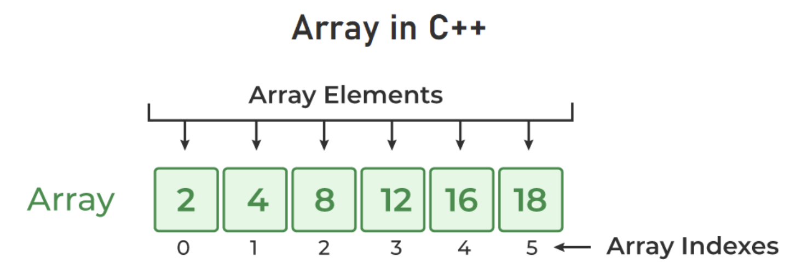

<div style="font-size: 17px;background: black;padding: 2rem;">

In C++, an array is a data structure that is used to store multiple values of similar data types in a contiguous memory location. For example, if we have to store the marks of 4 or 5 students then we can easily store them by creating 5 different variables but what if we want to store marks of 100 students or say 500 students then it becomes very challenging to create that numbers of variable and manage them. Now, arrays come into the picture that can do it easily by just creating an array of the required size.

- An Array is a collection of data of the same data type, stored at a <span style="color: Cyan;">contiguous memory location</span>.
- Indexing of an array starts from 0. It means the first element is stored at the 0th index, the second at 1st, and so on.
- Elements of an array can be accessed using their indices.
- Once an array is declared its size remains constant throughout the program.
- An array can have multiple dimensions.
- The number of elements in an array can be determined using the `sizeof` operator.
- We can find the size of the type of elements stored in an array by subtracting adjacent addresses.

<br>

<br>
<br>

<h3 style="border-bottom: 2px solid white; padding-bottom: 2px; display: inline-block;">Array declaration:</h3>

```
data_type array_name[Size_of_array];
```

Example:

```c++
int arr[5];
```

- <b style="color: Salmon;">int</b>: It is the type of data to be stored in the array. We can also use other data types such as char, float, and double.
- <b style="color: Salmon;">arr</b>: It is the name of the array.
- <b style="color: Salmon;">5</b>: It is the size of the array which means only 5 elements can be stored in the array.


<h3 style="border-bottom: 2px solid white; padding-bottom: 2px; display: inline-block;">Initializing an array</h3>

In C++, we can initialize an array in many ways but we will discuss some most common ways to initialize an array. We can initialize an array at the time of declaration or after declaration.

- <b style="color: HotPink;">Initialize Array with Values: </b>We have initialized the array with values. The values enclosed in curly braces ‘{}’ are assigned to the array. Here, 1 is stored in arr[0], 2 in arr[1], and so on. Here the size of the array is 5.

    ```c++
    int arr[5] = {1, 2, 3, 4, 5};
    ```

    We can avoid writing the length of array in square brackets. The length of an array will automatically become equal to the number of elements inside curly braces.

    ```c++
    int arr[] = {1, 2, 3, 4, 5};
    ```

    If we give lesser values in curly braces than size specified, rest of the indices will store 0.

    ```c++
    int arr[5] = {1, 2}; // arr -> [1, 2, 0, 0, 0]
    ```
- <b style="color: HotPink;">Initialize Array after Declaration (Using Loops): </b>We have initialized the array using a loop after declaring the array. This method is generally used when we want to take input from the user or we cant to assign elements one by one to each index of the array. 

    ```c++
    int arr[N];

    for (int i = 0; i < N; i++) {
        arr[i] = value;
    }
    ```

<h3 style="border-bottom: 2px solid white; padding-bottom: 2px; display: inline-block;">Accessing, updating and looping arrays</h3>

Elements of an array can be accessed by specifying the name of the array, then the index of the element enclosed in the array subscript operator `[]`. For example, `arr[i]`. To update any element (say of index `i`), we can directly assign the value to it: `arr[i] = value`. We can traverse over the array with the help of a loop using indexing.

```c++
int main() 
{ 
   int arr[] = {1, 2, 3}; 
  
    // Accessing and printing elements of the array 
    cout << "arr[0]: " << arr[0] << endl; // arr[0]: 1
    cout << "arr[1]: " << arr[1] << endl; // arr[1]: 2
    cout << "arr[2]: " << arr[2] << endl; // arr[2]: 3

    arr[0] = 5; arr[1] = 6; arr[2] = 7; // Update all values of arr

    for(int i = 0; i < 3; i++){
        cout << arr[i] << " ";
    }

    // Output -> 5 6 7

    return 0; 
}
```

<div style="border: 1px solid yellow; padding: 10px;">

We can calculate the size of an array using <b style="color: Chartreuse;">sizeof()</b> operator trick. First, we find the size occupied by the whole array in the memory and then divide it by the size of the type of element stored in the array. This will give us the number of elements stored in the array.

```
data_type size = sizeof(Array_name) / sizeof(Array_name[index]);
```
</div>

<br>

<h3 style="border-bottom: 2px solid white; padding-bottom: 2px; display: inline-block;">Relationship between Array and Pointers</h3>

In C++, arrays and pointers are closely related to each other. The array name is treated as a pointer that stored the memory address of the first element of the array. In array, elements are stored at contiguous memory locations that’s why we can access all the elements of an array using the array name.

```c++
int arr[] = { 1, 2, 3, 4 }; 
  
int* ptr = arr; 
  
// Printing address of the arrary using array name 
cout << "Memory address of arr: " << &arr << endl; // Memory address of arr: 0x7fff2f2cabb0
  
// Printing address of the array using ptr 
cout << "Memory address of arr: " << ptr << endl; // Memory address of arr: 0x7fff2f2cabb0
```

<b>Explanation:</b>

In the above code, we first define an array `arr` and then declare a pointer `ptr` and assign the array `arr` to it. We are able to assign arr to `ptr` because `arr` is also a pointer. After that, we print the memory address of `arr` using reference operator `(&)` and also print the address stored in pointer `ptr` and we can see `arr` and `ptr`, both stores the same memory address.

<h4><u>Printing Array Elements without Indexing:</u></h4>

We generally access and print the array elements using indexing. For example to access the first element we use `array_name[0]`. We have discussed above that the array name is a pointer that stored the address of the first element and array elements are stored at contiguous locations. Now, we are going to access the elements of an array using the array name only.

```c++
int arr[] = { 11, 22, 33, 44 }; 
  
// Print elements of an array 
cout << "first element: " << *arr << endl; 
cout << "Second element: " << *(arr + 1) << endl; 
cout << "Third element: " << *(arr + 2) << endl; 
cout << "fourth element: " << *(arr + 3) << endl; 
  
return 0; 
```

<b>Explanation:</b>

In the above code, we first declared an array `arr` with four elements. After that, we are printing the array elements. As we know, array name is a pointer that stores the address of the first element of an array so, to print the first element we have dereferenced that pointer `(*arr)` using dereferencing operator `(*)` which prints the data stored at that address.

To print the second element of an array we first add 1 to `arr` which is equivalent to `(address of arr + size_of_one_element *1)` that takes the pointer to the address just after the first one and after that, we dereference that pointer to print the second element. Similarly, we print rest of the elements of an array without using indexing.

<h3 style="border-bottom: 2px solid white; padding-bottom: 2px; display: inline-block;">Passing Array to Function</h3>

<b style="color: HotPink;">Passing Array as a Pointer: </b>In this method, we simply pass the array name in function call which means we pass the address to the first element of the array. In this method, we can modify the array elements within the function.

<b style="color: HotPink;">Passing Array as an Array (Sized/Unsized): </b>In this method, the function accepts the array using a simple array declaration with no size/size of array passed as an argument.

```c++
void printArray1(int *arrPtr, int size) {
    for (int i = 0; i < size; ++i) {
        cout << arrPtr[i] << " ";
    }
}

void printArray2(int arr[], int size) {
    for (int i = 0; i < size; ++i) {
        cout << arr[i] << " ";
    }
}

int main() {
    int numbers[5] = {1, 2, 3, 4, 5};
    printArray1(numbers, 5);
    printArray2(numbers, 5); 
    return 0;
}
```

<b style="color: Chartreuse;">Note:</b> Array will be treated as a pointer in the passed function no matter what method we use. As the array are passed as pointers, they will loose the information about its size leading to a phenomenon named as <span style="color: Cyan;">Array Decay</span>.

<br>

# Multidimensional Arrays

Arrays declared with more than one dimension are called multidimensional arrays. The most widely used multidimensional arrays are 2D arrays and 3D arrays. These arrays are generally represented in the form of rows and columns. Multidimensional Array Declaration:

```
Data_Type Array_Name[Size1][Size2]...[SizeN];
```

<span style="color: Violet;">Data_Type:</span> Type of data to be stored in the array.

<span style="color: Violet;">Array_Name:</span> Name of the array.

<span style="color: Violet;">Size1, Size2,…, SizeN:</span> Size of each dimension.

Example:

```c++
int a[2][3] = {{1, 2, 3}, {4, 5, 6}}; // 2*3 matrix
 /*
 a[0][0] = 1; a[0][1] = 2; a[0][2] = 3;
 a[1][0] = 4; a[1][1] = 5; a[1][2] = 6;
 */
```

The size of an array is equal to the size of the data type multiplied by the total number of elements that can be stored in an array. We can calculate the total number of elements in an array by multiplying the size of each dimension of a multidimensional array.

</div>

<!-- <div style="font-size: 17px;background: black;padding: 2rem;"> -->
<!-- <div style="background: DarkRed;padding: 0.3rem 0.8rem;"> [HIGHLIGHT] -->
<!-- <h3 style="border-bottom: 2px solid white; padding-bottom: 2px; display: inline-block;"> [SUBHEADING] -->
<!-- <b style="color: Chartreuse;"> [NOTE] -->
<!-- <b style="color:red;"> [NOTE-2] -->
<!-- <span style="color: Cyan;"> [IMP] -></span> -->
<!-- <b style="color: Salmon;"> [POINT] -->
<!-- <div style="border: 1px solid yellow; padding: 10px;"> [BORDER] -->