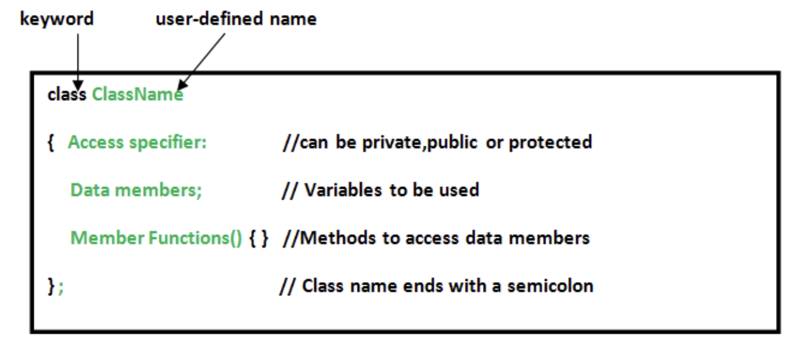

<div style="font-size: 17px;background: black;padding: 2rem;">

Object-Oriented Programming (OOP) is a programming paradigm that uses "objects" to design applications and computer programs. It leverages several key concepts to make software design more modular, reusable, and maintainable.

<b style="color: Salmon;">Class: </b>The building block of C++ that leads to Object-Oriented programming is a Class. It is a user-defined data type, which holds its own data members and member functions, which can be accessed and used by creating an instance of that class. A class is like a blueprint for an object.

<b style="color: Salmon;">Object: </b>An Object is an instance of a Class. When a class is defined, no memory is allocated but when it is instantiated (i.e. an object is created) memory is allocated.

<h3 style="border-bottom: 2px solid white; padding-bottom: 2px; display: inline-block;">DEFINING CLASS:</h3>

A class is defined in C++ using the keyword class followed by the name of the class. The body of the class is defined inside the curly brackets and terminated by a semicolon at the end.

<br>

<br>
<br>

<h3 style="border-bottom: 2px solid white; padding-bottom: 2px; display: inline-block;">DECLARING OBJECTS:</h3>

When a class is defined, only the specification for the object is defined; no memory or storage is allocated. To use the data and access functions defined in the class, you need to create objects.

```
ClassName ObjectName;
```

<b style="color:red;">Note:</b> We can also create object at the end just before the semicolon while defining a class. As a result, once execution reaches at that line, it creates a class and allocates memory to your object.

<h3 style="border-bottom: 2px solid white; padding-bottom: 2px; display: inline-block;">ACCESSING DATA MEMBERS AND MEMBER FUNCTIONS:</h3>

The data members and member functions of the class can be accessed using the `dot(‘.’)` operator with the object. For example, if the name of the object is `obj` and you want to access the member function with the name `printName()` then you will have to write `obj.printName()`. Accessing a data member depends solely on the access control of that data member. This access control is given by <span style="color: Cyan;">Access modifiers</span> in C++. There are three access modifiers: `public`, `private`, and `protected`. The private data members are not allowed to be accessed directly by the object.

```c++
class User {

public: // Access specifier

   string userName; // Data  Members
   int age;

   void printname() { cout << "userName is:" << userName; } // Member Functions()
};

int main()
{
   User obj1; // Declare an object of class User

   obj1.userName = "Virat Kohli"; // accessing data member
   obj1.age = 38;

   obj1.printname(); // accessing member function

   return 0;
}
```

We can also define member function outside the class definition we have to use the scope resolution operator (`::`) along with the class name and function name.

```c++
void User::printAge() {
 cout << "age is:" << age;
}
```

<b style="color:red;">Note:</b> All the member functions defined inside the class definition are by default `inline`.

<br>

# Constructors

- Constructor is a member function of a class, whose name is the same as the class name.
- Constructor is a special type of member function that is used to initialize the data members for an object of a class automatically when an object of the same class is created.
- Constructor is invoked at the time of object creation. It constructs the values i.e. provides data for the object that is why it is known as a constructor.
- Constructors do not return value, hence they do not have a return type.
- A constructor gets called automatically when we create the object of the class.
- Constructors can be overloaded.
- A constructor can not be declared virtual.
- Constructors are mostly declared in the public section of the class though they can be declared in the private section of the class.
- A constructor cannot be inherited.
- The constructor makes implicit calls to `new` and `delete` operators during memory allocation.

```c++
class student {
    int rno;
    string name;
    double fee;
 
public:
    // constructor
    student() {
        rno = 21; name="HD"; fee=10222.34;
    }
 
    void display() {
        cout << endl << rno << "\t" << name << "\t" << fee;
    }
};
 
int main()
{
    student s; // constructor gets called automatically when we create the object of the class
    s.display();
    return 0;
}
```

## Types of Constructor

Constructors can be classified based on in which situations they are being used. There are 4 types of constructors in C++:

1. Default Constructor
2. Parameterized Constructor
3. Copy Constructor
4. Move Constructor

<h3 style="border-bottom: 2px solid white; padding-bottom: 2px; display: inline-block;">1. Default Constructor</h3>

It is a constructor that doesn’t take any argument. It has no parameters. It is also called a zero-argument constructor.

```c++
class construct {
public:
    int a, b;
 
    construct() // Default Constructor
    {
        a = 10;
        b = 20;
    }
};
```

<span style="color: HotPink;">Even if we do not define any constructor explicitly, the compiler will automatically provide a default constructor implicitly.</span>

<h3 style="border-bottom: 2px solid white; padding-bottom: 2px; display: inline-block;">2. Parameterized Constructor</h3>

Parameterized Constructors make it possible to pass arguments to constructors. Typically, these arguments help initialize an object when it is created. To create a parameterized constructor, simply add parameters to it the way you would to any other function. When you define the constructor’s body, use the parameters to initialize the object.

```c++
class Point {
private:
    int x, y;
 
public:
    Point(int x1, int y1) // Parameterized Constructor
    {
        x = x1;
        y = y1;
    }
 
    int getX() { return x; }
    int getY() { return y; }
};
```

<div style="background: DarkRed;padding: 0.3rem 0.8rem;">

When the parameterized constructor is defined and no default constructor is defined explicitly, the compiler will not implicitly create the default constructor and hence creating a simple object as: `Student s;` will flash an error. When an object is declared in a parameterized constructor, the initial values have to be passed as arguments to the constructor function. Hence, whenever we define one or more non-default constructors( with parameters ) for a class, a default constructor( without parameters ) should also be explicitly defined.
</div>

<br>

<i>Just like normal functions, we can also define default values for the arguments of parameterized constructors. All the rules of the default arguments will be applied to these parameters.</i>

```c++
class HD {
 private:
    int data;
 
 public:
    HD(int x = 0) { data = x; } // parameterized constructor with default values
 
    int getData() { return data; }
};

int main()
{
  HD obj1; // will not throw error
  
  HD obj2(25);
 
  cout << "First Object Data: " << obj1.getData() << endl;
  cout << "Second Object Data: " << obj2.getData() << endl;
 
  return 0;
}
```

<div style="border: 1px solid yellow; padding: 10px; font-weight: bold;">
As we can see, when the default values are assigned to every argument of the parameterized constructor, it is legal to create the object without passing any parameters just like default constructors. So, this type of constructor works as both a default and parameterized constructor.
</div>

<h3 style="border-bottom: 2px solid white; padding-bottom: 2px; display: inline-block;">3. Copy Constructor</h3>

A copy constructor is a constructor that initializes an object using another object of the same class. It is used to create a new object as a copy of an existing object. The copy constructor can be defined explicitly by the programmer. If the programmer does not define the copy constructor, the compiler does it for us  just like default constructors. Copy constructor takes a reference to an object of the same class as an argument. A sample copy constructor:

```c++
Sample(Sample &t) {
    id=t.id;
}
```
<div style="background: DarkRed;padding: 0.3rem 0.8rem;">
If you pass the object by value in the copy constructor, it would result in a recursive call to the copy constructor itself. This happens because passing by value involves making a copy, and making a copy involves calling the copy constructor, leading to an infinite loop. Using a reference avoids this recursion.
</div>

<br>

```c++
class Point {
private:
    int x, y;
 
public:
    Point(int x1, int y1)
    { x = x1; y = y1;}
 
    Point(const Point& p1){ x = p1.x; y = p1.y;}     // Copy constructor
 
    int getX() { return x; }
    int getY() { return y; }
};
 
int main()
{
    Point p1(10, 15); // Normal constructor is called here
    Point p2 = p1; // Copy constructor is called here
 
    // Let us access values assigned by constructors
    cout << "p1.x = " << p1.getX() << ", p1.y = " << p1.getY();
    cout << "\np2.x = " << p2.getX() << ", p2.y = " << p2.getY();
    return 0;
}
```

<b style="color: Red;">Note: </b>Reason for passing `const` reference is, that we should use `const` in C++ wherever possible so that objects are not accidentally modified.

<b style="color: Chartreuse;">Default Copy Constructor: </b>This default constructor performs a <span style="color: Cyan;">shallow copy</span> of the object's members. It copies each data member of the source object to the corresponding data member of the target object.

```c++
class MyClass {
public:
    int x;
    float y;
    // No user-defined copy constructor; the compiler provides a default one
};

int main() {
    MyClass obj1;
    obj1.x = 5;
    obj1.y = 10.5;
    
    MyClass obj2 = obj1;  // Default copy constructor is called. It is same as -> MyClass obj2(obj1).
    // obj2.x is 5 and obj2.y is 10.5
    return 0;
}
```

<b style="color: Chartreuse;">User-Defined Copy Constructor: </b>A user-defined copy constructor is explicitly defined by the programmer. It is useful when the default behavior of the compiler-provided copy constructor is not suitable, such as when dealing with dynamic memory allocation, file handling or when you need to perform a <span style="color: Cyan;">deep copy</span>.

```c++
class Sample {
    int id;
 
public:
    void init(int x) { id = x; }
    Sample() {} // default constructor with empty body
 
    Sample(Sample& t) // copy constructor
    {
        id = t.id;
    }
    void display() { cout << endl << "ID=" << id; }
};
int main()
{
    Sample obj1;
    obj1.init(10);
    obj1.display();
 
    Sample obj2(obj1); // or obj2=obj1;    copy constructor called
    obj2.display();
    return 0;
}
```

<b><u>When is the copy constructor called?</u></b>

<span style="color: LightGreen;">When an object is initialized with another object of the same class using the assignment operator (=).</span><br>
For example, if you have two objects of the same class, obj1 and obj2, and you assign obj1 to obj2, the copy constructor will be called to copy the values of the data members of obj1 to obj2.

<span style="color: LightGreen;">When an object is passed by value to a function.</span><br>
For example, if you have a function that takes an object of a class as a parameter, and you pass an object of that class to the function by value, the copy constructor will be called to create a copy of the object that is passed to the function.

<span style="color: LightGreen;">When an object is returned by value from a function.</span>
For example, if you have a function that returns an object of a class, and you call that function and assign the returned object to a variable, the copy constructor will be called to create a copy of the object that is returned from the function.

<br>

<div style="border: 3px solid cyan; padding: 10px;">

<h4><u>Copy constructor vs Assignment Operator</u></h4>

The main difference between Copy Constructor and Assignment Operator is that the Copy constructor makes a new memory storage every time it is called while the assignment operator does not make new memory storage.

```c++
MyClass t1, t2;
MyClass t3 = t1;  // ----> (1)
t2 = t1;          // -----> (2) 
```

A copy constructor is called when a new object is created from an existing object, as a copy of the existing object. The assignment operator is called when an already initialized object is assigned a new value from another existing object. In the above example (1) calls the copy constructor and (2) calls the assignment operator.

</div>

<br>

A copy constructor can be made private. When we make a copy constructor private in a class, objects of that class become non-copyable. This is particularly useful when our class has pointers or dynamically allocated resources. In such situations, we can either write our own copy constructor like the above String example or make a private copy constructor so that users get compiler errors rather than surprises at runtime.

<br>

# Destructors

Destructors are special member functions of a class that are executed when an object of that class goes out of scope or is explicitly deleted. Destructors are used to perform clean-up operations such as releasing resources that the object may have acquired during its lifetime (e.g., dynamically allocated memory, file handles, network connections, etc.). This ensures that these resources are properly freed and do not lead to resource leaks.

- A destructor is also a special member function like a constructor. Destructor destroys the class objects created by the constructor. 
- Destructor has the same name as their class name preceded by a tilde (~) symbol.
- It is not possible to define more than one destructor. 
- The destructor is only one way to destroy the object created by the constructor. Hence destructor can-not be overloaded.
- Destructor neither requires any argument nor returns any value.
- It is automatically called when an object goes out of scope. 
- Destructor release memory space occupied by the objects created by the constructor.
- In destructor, objects are destroyed in the reverse of an object creation.

```c++
class ClassName {
public:
    // Constructor
    ClassName() {
        // Initialization code
    }

    // Destructor
    ~ClassName() {
        // Clean-up code
    }
};
```

If we do not write our own destructor in class, the compiler creates a default destructor for us. The default destructor works fine unless we have dynamically allocated memory or pointer in class. When a class contains a pointer to memory allocated in the class, we should write a destructor to release memory before the class instance is destroyed. This must be done to avoid memory leaks.

</div>

<!-- <div style="font-size: 17px;background: black;padding: 2rem;"> -->
<!-- <div style="background: DarkRed;padding: 0.3rem 0.8rem;"> [HIGHLIGHT] -->
<!-- <h3 style="border-bottom: 2px solid white; padding-bottom: 2px; display: inline-block;"> [SUBHEADING] -->
<!-- <b style="color: Chartreuse;"> [NOTE] -->
<!-- <b style="color:red;"> [NOTE-2] -->
<!-- <span style="color: Cyan;"> [IMP] -></span> -->
<!-- <b style="color: Salmon;"> [POINT] -->
<!-- <div style="border: 1px solid yellow; padding: 10px;"> [BORDER] -->
