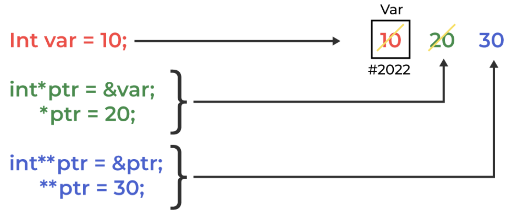

<div style="font-size: 17px;background: black;padding: 2rem;">

In C++ pointers and references both are mechanisms used to deal with memory, memory address, and data in a program. Pointers are used to store the memory address of another variable whereas references are used to create an alias for an already existing variable. 

# Pointers

Pointers are a fundamental and powerful feature in C++ that provide a way to directly access and manipulate memory. Understanding pointers is crucial for low-level programming, efficient memory management, and dealing with dynamic data structures like linked lists and trees.

A pointer is a variable that stores the memory address of another variable. Rather than holding a data value directly, a pointer holds the address where the data is located.

To declare a pointer, you specify the type of data it points to, followed by an asterisk `(*)` and the pointer's name. Initialization typically involves assigning the address of another variable to the pointer using the `address-of operator (&)`. The reason we associate data type with a pointer is that it knows how many bytes the data is stored in. When we increment a pointer, we increase the pointer by the size of the data type to which it points.

```c++
int main() {
    int var = 10;       // A normal integer variable
    int *ptr = &var;    // A pointer to an integer, initialized to the address of var

    std::cout << "Value of var: " << var << std::endl;
    std::cout << "Address of var: " << &var << std::endl;
    std::cout << "Pointer ptr pointing to address: " << ptr << std::endl;
    std::cout << "Value pointed to by ptr: " << *ptr << std::endl; // Dereferencing the pointer

    return 0;
}
```

<br>

<br>
<br>

<h3 style="border-bottom: 2px solid white; padding-bottom: 2px; display: inline-block;">Pointer Arithmetic</h3>

Pointer arithmetic means performing arithmetic operations on pointers. It refers to the operations that are valid to perform on pointers. Following are the arithmetic operations valid on pointers in C++:

<b style="color: Salmon;">Incrementing and Decrementing Pointers: </b>Incrementing or decrementing a pointer will make it refer to the address of the next or previous data in the memory i.e. the <span style="color: Yellow;">address increases or decreases by 1 multiplied by the size of the data type it is pointing to</span> (one of the reasons why the pointer declaration requires the information about the type of data it is pointing to). If the pointer stored the address of the integer type variable then the size of the integer pointer can be 4 or 8 bytes depending upon the 32-bit machine or 64-bit machine respectively. So, now if we increment an integer type variable it will be incremented by 4 bytes or 8 bytes depending upon its size. For example, If a pointer holds the address 1000 and we increment the pointer, then the pointer will be incremented by 4 or 8 bytes (size of the integer), and the pointer will now hold the address 1004.

<b style="color: Salmon;">Addition and Subtraction of Constant to Pointers: </b> We can add/subtract integer values to Pointers and the pointer is adjusted based on the size of the data type it points to. For example, if an integer pointer stores the address 1000 and we add the value 5 to the pointer, it will store the new address as:
```
1000 + (5 * 4(size of an integer)) = 1020
```

<b style="color: Salmon;">Subtraction of Two Pointers of the Same Type: </b>The Subtraction of two pointers can be done only when both pointers are of the same data type. The subtraction of two pointers gives the number of elements present between the two pointers.

<b style="color: Salmon;">Comparison of Pointers: </b>In C++, we can perform a comparison between the two pointers using the relational operators(>, <, >=, <=, ==, !=). We generally use this operation to check whether the two-pointer as pointing to the same memory location or not. <span style="color: Cyan;">We can compare the pointer of a type to NULL. This operation helps us to find whether the given pointer points to some memory address or not. It helps us to control errors such as segmentation faults.</span>

<h3 style="border-bottom: 2px solid white; padding-bottom: 2px; display: inline-block;">Pointers to pointers</h3>

In C++, we can create a pointer to a pointer that in turn may point to data or another pointer. The syntax simply requires the unary operator (*) for each level of indirection while declaring the pointer.

```c++
char a;
char *b;
char ** c;
a = ’g’;
b = &a;
c = &b;
```

</div>

<!-- <div style="font-size: 17px;background: black;padding: 2rem;"> -->
<!-- <div style="background: DarkRed;padding: 0.3rem 0.8rem;"> [HIGHLIGHT] -->
<!-- <h3 style="border-bottom: 2px solid white; padding-bottom: 2px; display: inline-block;"> [SUBHEADING] -->
<!-- <b style="color: Chartreuse;"> [NOTE] -->
<!-- <b style="color:red;"> [NOTE-2] -->
<!-- <span style="color: Cyan;"> [IMP] -></span> -->
<!-- <b style="color: Salmon;"> [POINT] -->
<!-- <div style="border: 1px solid yellow; padding: 10px;"> [BORDER] -->