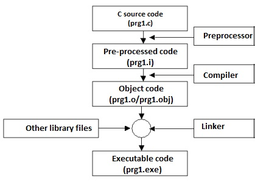

<div style="font-size: 17px;background: black;padding: 2rem;">

Preprocessors are programs that process the source code before compilation. Several steps are involved between writing a program and executing a program in C/C++. Have a look at these steps before we actually start learning about Preprocessors.

<br>

<br>
<br>

You can see the intermediate steps in the above diagram. The source code written by programmers is first stored in a file, let the name be “program.c“. This file is then processed by preprocessors and an expanded source code file is generated named “program.i”. This expanded file is compiled by the compiler and an object code file is generated named “program.obj”. Finally, the linker links this object code file to the object code of the library functions to generate the executable file “program.exe”. 

Preprocessor programs provide preprocessor directives that tell the compiler to preprocess the source code before compiling. All of these preprocessor directives begin with a `'#' (hash)` symbol. The `#` symbol indicates that whatever statement starts with a `#` will go to the preprocessor program to get executed. We can place these preprocessor directives anywhere in our program.

Examples of some preprocessor directives are: `#include`, `#define`, `#ifndef`, etc.

<i style="color: Cyan;">Remember that the `#` symbol only provides a path to the preprocessor, and a command such as include is processed by the preprocessor program. For example, `#include` will include the code or content of the specified file in your program.</i>

<br>

# Common preprocessor directives

<h3 style="border-bottom: 2px solid white; padding-bottom: 2px; display: inline-block;">File inclusion</h3>

This type of preprocessor directive tells the compiler to include a file in the source code program. The `#include` preprocessor directive is used to include the header files in the C program. There are two types of files that can be included by the user in the program:

- **Standard Header Files:** The standard header files contain definitions of pre-defined functions like `printf()`, `scanf()`, etc. These files must be included to work with these functions. Different functions are declared in different header files.
For example, standard I/O functions are in the `iostream` file whereas functions that perform string operations are in the `string` file. Syntax:

    ```c++
    #include <file_name>
    ```
    Here `file_name` is the name of the header file to be included. The `<` and `>` brackets tell the compiler to look for the file in the standard directory.
- **User-defined Header Files:** When a program becomes very large, it is a good practice to divide it into smaller files and include them whenever needed. These types of files are user-defined header files. Syntax:

```c++
#include "filename"
```

The `double quotes ( ” ” )` tell the compiler to search for the header file in the source file’s directory.


<h3 style="border-bottom: 2px solid white; padding-bottom: 2px; display: inline-block;">Macros</h3>

Macros are pieces of code in a program that is given some name. Whenever this name is encountered by the compiler, the compiler replaces the name with the actual piece of code. The `#define` directive is used to define a macro.

Syntax:

```c++
#define token value
```

Here, after preprocessing, the `token` will be expanded to its `value` in the program.

Example code:

```c++
#define PI 3.1415   // value of pi
```

Full-fledged code:

```c++
#include <iostream>

// create a macro named PI
// with the value 3.1415
#define PI 3.1415

using namespace std;

int main() {

    double radius, area;
    
    cout << "Enter the radius: ";
    cin >> radius;

    // use PI to calculate area of a circle
    area = PI * radius * radius;
    cout << "Area = " << area;
    
    return 0;
}
```

Output:

```
Enter the radius: 4
Area = 50.264
```

<h4><u>Function-like Macros:</u></h4>

We can also use `#define` to create macros that work like a function.

```c++
#define circleArea(r) (3.1415 * r * r)
```

Working example:

```c++
#include <iostream>
#define PI 3.1415

// macro that calculates area of circle
// and takes parameter 'r'
#define circle_area(r) (PI * r * r)

using namespace std;

int main() {
    
    double radius = 2.5;

    // call the circle_area() macro
    // pass radius as an argument
    cout << "Area = " << circle_area(radius); // Area = 19.6344
    
    return 0;
}
```

<b style="color: Salmon;">Note:</b> It is better to use functions rather than function-like macros as macros are more error-prone.

</div>

<!-- <div style="font-size: 17px;background: black;padding: 2rem;"> -->
<!-- <div style="background: DarkRed;padding: 0.3rem 0.8rem;"> [HIGHLIGHT] -->
<!-- <h3 style="border-bottom: 2px solid white; padding-bottom: 2px; display: inline-block;"> [SUBHEADING] -->
<!-- <b style="color: Chartreuse;"> [NOTE] -->
<!-- <b style="color:red;"> [NOTE-2] -->
<!-- <span style="color: Cyan;"> [IMP] -></span> -->
<!-- <b style="color: Salmon;"> [POINT] -->
<!-- <div style="border: 1px solid yellow; padding: 10px;"> [BORDER] -->