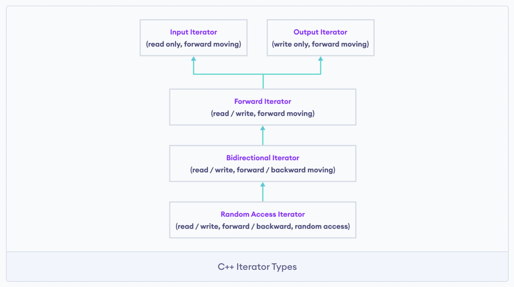

<div style="font-size: 17px;background: black;padding: 2rem;">

The Standard Template Library (STL) is a powerful set of C++ template classes and functions designed to provide generic implementations of commonly used data structures and algorithms. The STL allows developers to create programs that are more efficient, reusable, and easier to maintain. The primary components of the STL are <span style="color: Cyan;">containers</span>, <span style="color: Orange;">iterators</span> and <span style="color: LightGreen;">algorithms</span>.

# Containers

A container is a holder object that stores a collection of other objects (its elements). They are implemented as class templates, which allows great flexibility in the types supported as elements. The container manages the storage space for its elements and provides member functions to access them, either directly or through iterators (reference objects with similar properties to pointers).

<h3 style="border-bottom: 2px solid white; padding-bottom: 2px; display: inline-block;">Types of containers:</h3>

<b style="color: Salmon;">Sequence Containers:</b> These containers store elements in a linear sequence.

- vector
- list
- deque
- arrays
- forward_list

<b style="color: Salmon;">Container Adaptors:</b> They provide a different interface for sequential containers.

- queue
- priority_queue
- stack

<b style="color: Salmon;">Associative Containers:</b> They implement sorted data structures that can be quickly searched (O(log n) complexity).

- set
- multiset
- map
- multimap

<b style="color: Salmon;">Unordered Associative Containers:</b> They implement unordered data structures that can be quickly searched.

- unordered_set
- unordered_multiset
- unordered_map
- unordered_multimap

<br>

## Vector

Vectors have the ability to resize themselves automatically when an element is inserted or deleted, with their storage being handled automatically by the container. Vector elements are placed in contiguous storage so that they can be accessed and traversed using iterators. In vectors, data is inserted at the end. Inserting at the end takes differential time, as sometimes the array may need to be extended. Removing the last element takes only constant time because no resizing happens. Inserting and erasing at the beginning or in the middle is linear in time.

<b><u>SYNTAX</u></b>

```
std::vector<dataType> vectorName;
```

<b><u>INITIALIZATION</u></b>

<b style="color: Salmon;">Using List: </b> We pass the list of elements to the vector constructor to create a vector with the specified elements.

```
vector<dataType> name({ value1, value2, value3 ....});
```

<b style="color: Salmon;">With single value: </b> We specify the size of the vector and then initialize every element of the vector with the value. If we don't give value, it is initialized with 0.

```
vector<dataType> name(size, value);
```

<b style="color: Salmon;">From Another Vector: </b> Used to create a vector that is an exact copy of other vector.

```
vector<dataType> name(other_vec);
```

<b style="color: Salmon;">From an array: </b> Used to create a vector that is an exact copy of an array.

```
vector<int> v(arr, arr + n);
```

<h3 style="border-bottom: 2px solid white; padding-bottom: 2px; display: inline-block;">Commonly used member functions</h3>

- <b style="color: Chartreuse;">begin()</b> – Returns an iterator pointing to the first element in the vector
- <b style="color: Chartreuse;">end()</b> – Returns an iterator pointing to the theoretical element that follows the last element in the vector
- <b style="color: Chartreuse;">rbegin()</b> – Returns a reverse iterator pointing to the last element in the vector (reverse beginning). It moves from last to first element
- <b style="color: Chartreuse;">rend()</b> – Returns a reverse iterator pointing to the theoretical element preceding the first element in the vector (considered as reverse end)
- <b style="color: Chartreuse;">size()</b> – Returns the number of elements in the vector.
- <b style="color: Chartreuse;">empty()</b> – Returns whether the container is empty.
- <b style="color: Chartreuse;">reference operator [g]</b> / <b style="color: Chartreuse;">at(g)</b> – Returns a reference to the element at position ‘g’ in the vector
- <b style="color: Chartreuse;">front()</b> – Returns a reference to the first element in the vector
- <b style="color: Chartreuse;">back()</b> – Returns a reference to the last element in the vector
- <b style="color: Chartreuse;">push_back()</b> – It push the elements into a vector from the back
- <b style="color: Chartreuse;">pop_back()</b> – It is used to pop or remove elements from a vector from the back.
- <b style="color: Chartreuse;">insert()</b> – It inserts new elements before the element at the specified position. It can insert both single elements at particular position and range of elements also. <span style="color: Cyan;">Thus, it can be used for appending one vector to other also</span>.
- <b style="color: Chartreuse;">erase()</b> – It is used to remove elements from a container from the specified position or range.
- <b style="color: Chartreuse;">clear()</b> – It is used to remove all the elements of the vector container

```c++
vector<int> v({1, 2, 3, 4, 5}), v_({0}); // v = [1, 2, 3, 4, 5]

for (auto it = v.begin(); it != v.end(); it++)
  cout << *it << " "; // 1 2 3 4 5

for (auto it = v.rbegin(); it != v.rend(); it++)
  cout << *it << " "; // 5 4 3 2 1

cout<< v.size() <<endl; // 5
cout<< v.empty() <<endl; // 0 (false)
cout<< v[0] <<endl; // 1
cout<< v.front() <<endl; // 1
cout<< v.back() <<endl; // 5

v.push_back(6); // v = [1, 2, 3, 4, 5, 6]
v.pop_back(); // v = [1, 2, 3, 4, 5];
v.insert(v.begin()+2, 8); // v = [1, 2, 8, 3, 4, 5]
v.insert(v.end()-2, 9); // v = [1, 2, 8, 3, 9, 4, 5]
v_.insert(v_.end(), v.begin(), v.end()); // v_ = [0, 1, 2, 8, 3, 9, 4, 5]
v.erase(v.begin()); // v = [2, 8, 3, 9, 4, 5]
v.clear(); // v =[]
```

<br>

## Pair

Pair is used to combine together two values that may be of different data types. Pair provides a way to store two heterogeneous objects as a single unit. It is basically used if we want to store tuples. The pair container is a simple container defined in `<utility>` header consisting of two data elements or objects.

<b><u>SYNTAX</u></b>

```c++
pair <data_type1, data_type2> Pair_name
```

<b><u>INITIALIZATION</u></b>

```
pair <data_type1, data_type2> Pair_name (value1, value2) ;
```

```
Pair_Name = make_pair(value1, value2); // make_pair() is pre-defined function
```

```
Pair_Name = { value1, value2 }
```

<b><u>ACCESS MEMBERS</u></b>

To access the elements, we use variable name followed by dot operator followed by the keyword <b style="color: Chartreuse;">first</b> or <b style="color: Chartreuse;">second</b>.

```c++
pair <int, int> p(1, 2);
cout << p.first << " " << p.second;
```

<br>

## Stack

Stacks are a type of container adaptors with LIFO(Last In First Out) type of working, where a new element is added at one end (top) and an element is removed from that end only. Stack uses an encapsulated object of either vector or deque (by default) or list (sequential container class) as its underlying container, providing a specific set of member functions to access its elements. For creating a stack, we must include the `<stack>` header file in our code.

<b><u>SYNTAX</u></b>

```c++
stack <data_type> stack_name;
```

<h3 style="border-bottom: 2px solid white; padding-bottom: 2px; display: inline-block;">Member functions</h3>

- <b style="color: Chartreuse;">empty()</b> – Returns whether the stack is empty – Time Complexity : O(1)
- <b style="color: Chartreuse;">size()</b> – Returns the size of the stack – Time Complexity : O(1)
- <b style="color: Chartreuse;">top()</b> – Returns a reference to the top most element of the stack – Time Complexity : O(1)
- <b style="color: Chartreuse;">push(g)</b> – Adds the element ‘g’ at the top of the stack – Time Complexity : O(1)
- <b style="color: Chartreuse;">pop()</b> – Deletes the most recent entered element of the stack – Time Complexity : O(1)

<br>

## Queue

Queues are a type of container adaptors that operate in a first in first out (FIFO) type of arrangement. Elements are inserted at the back (end) and are deleted from the front. Queues use an encapsulated object of deque or list (sequential container class) as its underlying container, providing a specific set of member functions to access its elements.

<b><u>SYNTAX</u></b>

```c++
queue <data_type> queue_name;
```

<h3 style="border-bottom: 2px solid white; padding-bottom: 2px; display: inline-block;">Member functions</h3>

- <b style="color: Chartreuse;">empty()</b> - Returns whether the queue is empty. It return true if the queue is empty otherwise returns false.
- <b style="color: Chartreuse;">size()</b> - Returns the size of the queue.
- <b style="color: Chartreuse;">front()</b> - Returns a reference to the first element of the queue.
- <b style="color: Chartreuse;">back()</b> - Returns a reference to the last element of the queue.
- <b style="color: Chartreuse;">push(g)</b> - Adds the element ‘g’ at the end of the queue.
- <b style="color: Chartreuse;">pop()</b> - Deletes the first element of the queue.

<br>

## Deque

Double-ended queues are sequence containers with the feature of expansion and contraction on both ends. They are similar to vectors, but are more efficient in case of insertion and deletion of elements. Unlike vectors, contiguous storage allocation may not be guaranteed.

Double Ended Queues are basically an implementation of the data structure double-ended queue. A queue data structure allows insertion only at the end and deletion from the front. This is like a queue in real life, wherein people are removed from the front and added at the back. Double-ended queues are a special case of queues where insertion and deletion operations are possible at both the ends.

<span style="color: Cyan;">The functions for deque are same as vector, with an addition of push and pop operations for both front and back.</span>

The time complexities for doing various operations on deques are-

- Accessing Elements- O(1)
- Insertion or removal of elements- O(N)
- Insertion or removal of elements at start or end- O(1)

<h3 style="border-bottom: 2px solid white; padding-bottom: 2px; display: inline-block;">Member functions (other than those of vector)</h3>

- <b style="color: Chartreuse;">push_front()</b> - It is used to push elements into a deque from the front.
- <b style="color: Chartreuse;">push_back()</b> - This function is used to push elements into a deque from the back.
- <b style="color: Chartreuse;">pop_front()</b> - Used to pop or remove elements from a deque from the front. pop_back()
- <b style="color: Chartreuse;">pop_back()</b> - Used to pop or remove elements from a deque from the back.

<br>

## Priority Queue

A C++ priority queue is a type of container adapter, specifically designed such that the first element of the queue is either the greatest or the smallest of all elements in the queue, and elements are in non-increasing or non-decreasing order (hence we can see that each element of the queue has a priority {fixed order}).

In C++ STL, the top element is always the greatest by default. We can also change it to the smallest element at the top. Priority queues are built on the top of the max heap and use an array or vector as an internal structure. In simple terms, STL Priority Queue is the implementation of Heap Data Structure.

<b><u>SYNTAX FOR MAX HEAP (max first - default one)</u></b>

```
priority_queue <data_type> queue_name;
```

<b><u>SYNTAX FOR MIN HEAP (min first)</u></b>

```
priority_queue <data_type, vector<data_type>, greater<data_type>> gq;
```

<b><u>INITIALIZATION WITH VECTOR</u></b>

```c
priority_queue<data_type> pq(vec.begin(), vec.end());
```

`greater<data_type>` is a custom comparison function. This determines how the elements are ordered within the priority queue. In this specific example, `greater<data_type>` sets up a min-heap. It means that the smallest element will be at the top of the queue. <span style="color: Cyan;">Not only that we can use custom sorting method by replacing greater with custom comparator function</span>.

<h3 style="border-bottom: 2px solid white; padding-bottom: 2px; display: inline-block;">Member functions</h3>

- <b style="color: Chartreuse;">empty():</b> Returns whether the queue is empty.
- <b style="color: Chartreuse;">size():</b> Returns the size of the queue.
- <b style="color: Chartreuse;">top():</b> Returns a reference to the topmost element of the queue.
- <b style="color: Chartreuse;">push():</b> Adds the element ‘g’ at the end of the queue.
- <b style="color: Chartreuse;">pop():</b> Deletes the first element of the queue.

<br>

## Maps

Maps are associative containers that store elements in a mapped fashion. Each element has a key value and a mapped value. No two mapped values can have the same key values. `std::map` is the class template for map containers and it is defined inside the `<map>` header file.

<h3 style="border-bottom: 2px solid white; padding-bottom: 2px; display: inline-block;">Key Characteristics</h3>

- Elements are stored in a sorted order according to the key.
- Each key is unique.
- Typically implemented as a balanced binary search tree (e.g., red-black tree).
- Operations like insertion, deletion, and search have O(log n) complexity.
- Inserting or deleting elements does not invalidate iterators to other elements.

<b><u>SYNTAX</u></b>

```c++
map <key_data_type, value_data_type> map_name;
```

<b><u>2-D Map Example Code</u></b>

```c++
map <int, map<int,int>> map_name;
```

We can insert pairs directly or assign values using operator `[]`.

<h3 style="border-bottom: 2px solid white; padding-bottom: 2px; display: inline-block;">Member functions</h3>

- <b style="color: Chartreuse;">begin()</b> – Returns an iterator to the first element in the map.
- <b style="color: Chartreuse;">end()</b> – Returns an iterator to the theoretical element that follows the last element in the map.
- <b style="color: Chartreuse;">size()</b> – Returns the number of elements in the map.
- <b style="color: Chartreuse;">empty()</b> – Returns whether the map is empty.
- <b style="color: Chartreuse;">pair insert(keyvalue, mapvalue)</b> – Adds a new element to the map.
- <b style="color: Chartreuse;">erase(iterator position)</b> – Removes the element at the position pointed by the iterator.
- <b style="color: Chartreuse;">erase(const g)</b> – Removes the key-value ‘g’ from the map.
- <b style="color: Chartreuse;">clear()</b> – Removes all the elements from the map.
- <b style="color: Chartreuse;">find(g)</b> – Returns an iterator to the element with key-value ‘g’ in the map if found, else returns the iterator to end.
- <b style="color: Chartreuse;">upper_bound(g)</b> / <b style="color: Chartreuse;">lower_bound(key)</b> - Access value at key.
- <b style="color: Chartreuse;">map_name[key]</b> / <b style="color: Chartreuse;">at(key)</b> - Access value at key.

```c++
    // Declaration of a map with keys of type int and values of type std::string
    map<int, string> myMap;

    // Inserting elements
    myMap.insert(make_pair(1, "one"));
    myMap[2] = "two";
    myMap[3] = "three";

    // Accessing elements
    cout << "Key 1 has value: " << myMap[1] << endl;

    // Iterating over elements
    for (auto it = myMap.begin(); it != myMap.end(); ++it) {
    cout << it->first << ": " << it->second << endl;
    }

    // Finding an element
    auto it = myMap.find(2);
    if (it != myMap.end()) {
    cout << "Found key 2 with value: " << it->second << endl;
    } else {
    cout << "Key 2 not found." << endl;
    }

    // Erasing an element
    myMap.erase(2);

    // Size of the map
    cout << "Size of map: " << myMap.size() << endl;
```

<br>

## Sets

Sets are a type of associative container in which each element has to be unique because the value of the element identifies it. The values are stored in a specific sorted order i.e. either ascending or descending. It is defined inside the `<set>` header file.

Sets follow the Binary search tree implementation. The value of the element cannot be modified once it is added to the set, though it is possible to remove and then add the modified value of that element. Thus, the values are immutable.

<b><u>SYNTAX FOR INCREASING ORDER (default one)</u></b>

```
set <data_type> set_name;
```

<b><u>SYNTAX FOR DECREASING ORDER</u></b>

```
set <data_type, vector<data_type>, greater<data_type>> set_name;
```

<b><u>INITIALIZE A SET</u></b>

```c++
set<int> mySet(vec.begin(), vec.end());
```

<h3 style="border-bottom: 2px solid white; padding-bottom: 2px; display: inline-block;">Member functions</h3>

- <b style="color: Chartreuse;">begin()</b> – Returns an iterator to the first element in the set.
- <b style="color: Chartreuse;">end()</b> – Returns an iterator to the theoretical element that follows the last element in the set.
- <b style="color: Chartreuse;">size()</b> – Returns the number of elements in the set.
- <b style="color: Chartreuse;">empty()</b> – Returns whether the set is empty.
- <b style="color: Chartreuse;">insert(const g)</b> - Adds a new element ‘g’ to the set.
- <b style="color: Chartreuse;">erase(iterator position)</b> - Removes the element at the position pointed by the iterator.
- <b style="color: Chartreuse;">erase(const g)</b> - Removes the value ‘g’ from the set.
- <b style="color: Chartreuse;">clear()</b> - Removes all the elements from the set.
- <b style="color: Chartreuse;">find(const g)</b> - Returns an iterator to the element ‘g’ in the set if found, else returns the iterator to the end.
- <b style="color: Chartreuse;">lower_bound(const g)</b> - Returns an iterator to the first element that is equivalent to ‘g’ or definitely will not go before the element ‘g’ in the set.
- <b style="color: Chartreuse;">upper_bound(const g)</b> - Returns an iterator to the first element that will go after the element ‘g’ in the set.

```c++
    set<int> mySet;

    // Inserting elements
    mySet.insert(10);
    mySet.insert(20);
    mySet.insert(5);
    mySet.insert(10); // Duplicate elements are ignored

    // Accessing elements
    for (const int& element : mySet) {
    cout << element << endl;
    }

    // Finding an element
    auto it = mySet.find(20);
    if (it != mySet.end()) {
    cout << "Found element: " << *it << endl;
    } else {
    cout << "Element not found." << endl;
    }

    // Erasing an element
    mySet.erase(10);

    // Size of the set
    cout << "Size of set: " << mySet.size() << endl;
```

<br>

# Iterators

An iterator is an object (like a pointer) that points to an element inside the container. We can use iterators to move through the contents of the container. They can be visualized as something similar to a pointer pointing to some location and we can access the content at that particular location using them. Iterators play a critical role in connecting algorithm with containers along with the manipulation of data stored inside the containers. The most obvious form of an iterator is a pointer. A pointer can point to elements in an array and can iterate through them using the increment operator (++). But, all iterators do not have similar functionality as that of pointers. Depending upon the functionality of iterators they can be classified into five categories, as shown in the diagram below with the outer one being the most powerful one and consequently the inner one is the least powerful in terms of functionality.

<b style="border-bottom: 2px solid white; padding-bottom: 2px; font-size: 24px; display: inline-block;">Types of iterators</b>

Based upon the functionality of the iterators, they can be classified into five major categories:

- <b style="color: Violet;">Input Iterators:</b> They are the weakest of all the iterators and have very limited functionality. They can read elements in a sequence from the beginning to the end, such that no element is accessed more than once.
- <b style="color: Violet;">Output Iterators:</b> Just like input iterators, they are also very limited in their functionality and can only write elements to a sequence. So, we can say that input and output iterators are complementary to each other.
- <b style="color: Violet;">Forward Iterator:</b> They are higher in the hierarchy than input and output iterators, and contain all the features present in these two iterators. But, as the name suggests, they also can only move in a forward direction and that too one step at a time. Containers supported - <span style="color: Yellow;">Forward List</span>.
- <b style="color: Violet;">Bidirectional Iterators:</b> They have all the features of forward iterators along with the fact that they overcome the drawback of forward iterators, as they can move in both the directions, that is why their name is bidirectional. Containers supported - <span style="color: Yellow;">List</span>, <span style="color: Yellow;">Map</span>, <span style="color: Yellow;">Unordered Map</span>, <span style="color: Yellow;">Multimap</span>, <span style="color: Yellow;">Set</span>, <span style="color: Yellow;">Unordered Set</span> and <span style="color: Yellow;">Multiset</span>.
- <b style="color: Violet;">Random-Access Iterators:</b> They are the most powerful iterators. They are not limited to moving sequentially, as their name suggests, they can randomly access any element inside the container. They are the ones whose functionality are same as pointers. Containers supported - <span style="color: Yellow;">Vector</span> and <span style="color: Yellow;">Deque</span>.

<b style="color: Red;">Note:</b> None of the iterators are supported in stack, queue and priority queue.

<br>

<br>
<br>

<h3 style="border-bottom: 2px solid white; padding-bottom: 2px; display: inline-block;">Declaring and Defining iterators</h3>

We can define an iterator by using the following syntax:

```c++
vector<int>::iterator vec_itr; // create a vector iterator

map<char, int>::iterator map_itr; // create a map iterator
```

Here, we have created the iterators `vec_itr` and `map_itr` in order to traverse across elements in a vector or a map. Always remember that <span style="color: Cyan;">we cannot use iterators with containers with mismatching data types</span>.

<b style="color: Red;">Note:</b> We can use the `auto` keyword (C++ 11 onwards) to deduce the type of the iterator during initialization.

For example,

```c++
vector<string>::iterator itr = languages.begin();
```

Can be written as:

```c++
auto itr = languages.begin();
```

<h3 style="border-bottom: 2px solid white; padding-bottom: 2px; display: inline-block;">Iterator Fundamental Operations</h3>

- <b style="color: Chartreuse;">\*itr</b>: Returns the element at the current position.
- <b style="color: Chartreuse;">itr->m</b>: Returns the member value `m` of the object pointed by the iterator and is equivalent to `(*itr).m`.
- <b style="color: Chartreuse;">++itr</b> / <b style="color: Chartreuse;">itr++</b>: Moves iterator to the next position.
- <b style="color: Chartreuse;">-–itr</b> / <b style="color: Chartreuse;">itr--</b>: Moves iterator to the previous position.
- <b style="color: Chartreuse;">itr + i</b>: Moves iterator by `i` positions.
- <b style="color: Chartreuse;">itr1 == itr2</b>: Returns true if the positions pointed by the iterators are the same.
- <b style="color: Chartreuse;">itr1 != itr2</b>: Returns true if the positions pointed by the iterators are not the same.
- <b style="color: Chartreuse;">itr = itr1</b>: Assigns the position pointed by `itr1` to the `itr` iterator.

<b style="color: Orange;">Note:</b> Not all operations listed above can be performed on all types of iterators (as discussed in types of operators).

<br>

# <a href="https://www.geeksforgeeks.org/algorithms-library-c-stl/">Algorithms</a>

The algorithms library in the C++ Standard Template Library (STL) provides a collection of functions designed to perform operations on sequences of elements, such as arrays, vectors, and other containers. These algorithms can be broadly categorized into several types based on their functionality: searching, sorting, modifying, and more. The algorithms are designed to be generic and work with iterators, making them flexible and reusable across different container types.

- <b style="color: Chartreuse;">swap(a, b)</b> – Swaps variables a and b. They can be containers also.
- <b style="color: Chartreuse;">all_of()</b> – Tests condition on all elements.
- <b style="color: Chartreuse;">any_of()</b> – Test if any element in range fulfills condition. (same syntax as above)
- <b style="color: Chartreuse;">none_of()</b> – Test if no elements fulfills condition. (same syntax as above)
- <b style="color: Chartreuse;">find()</b> – Returns an iterator to the first occurrence of the specified element in the given sequence. If the element is not found, an iterator to the end is returned.
- <b style="color: Chartreuse;">count()</b> – Returns the number of occurrences of an element in a given range.
- <b style="color: Chartreuse;">count_if()</b> – Returns the number of elements in a range that satisfy the condition.
- <b style="color: Chartreuse;">equal()</b> – Test whether the elements in two ranges are equal.
- <b style="color: Chartreuse;">is_permutation()</b> – Tests whether a sequence is permutation of other or not.
- <b style="color: Chartreuse;">search()</b> – Test whether a sequence is present in given sequence or not. If not, iterator to end is returned or iterator of searched sequence is returned.
- <b style="color: Chartreuse;">reverse()</b> – It reverses the order of the elements of any container.
- <b style="color: Chartreuse;">rotate()</b> - It rotates the order of the elements in the range [first, last], in such a way that the element pointed by the middle becomes the new first element.
- <b style="color: Chartreuse;">copy()</b> - The generic copy function used to copy a range of elements from one container to another.
- <b style="color: Chartreuse;">fill()</b> - Fill range with a value.
- <b style="color: Chartreuse;">unique()</b> - Used to remove consecutive duplicate elements from a sorted range. It does this in-place and returns an iterator to the new end of the range. The function does not actually remove elements from the container but rather reorders the elements such that the unique elements appear at the beginning of the range.
- <b style="color: Chartreuse;">sort()</b> - Used for sorting containers. Custom sorting can also be done using 3rd parameter which is a function that defines how sorting is needed!
- <b style="color: Chartreuse;">remove()</b> - Reorders the elements given start iterator to end, moving all elements equal to given value to the end of the range and returning an iterator to the new end of the range.
- <b style="color: Chartreuse;">remove_if()</b> - Does same thing as above but instead of value, operation is performed as per callback function passed which checks for a condition on all values.
- <b style="color: Chartreuse;">is_sorted()</b> - Exactly like above but checks if container is sorted.
- <b style="color: Chartreuse;">binary_search()</b> - In a sorted container, returns true if an element is found.
- <b style="color: Chartreuse;">lower_bound()</b> - Returns an iterator pointing to the first element greater than or equal to `val` passed. If all the elements in the range compare less than val, the function returns iterator to end of range.
- <b style="color: Chartreuse;">upper_bound()</b> - Returns an iterator pointing to the first element in the range [first,last) which has a value strictly greater than ‘val’ and if the value is not present in the vector then it returns iterator to end of range.

  <b style="color: HotPink;">NOTE:</b> `upper_bound`, `lower_bound`, `binary_search` work on non-decreasing containers. We can pass 4th arg as `greater <int> ()` for non-increasing containers.

  ```c++
  // using lower_bound and upper_bound to return first and last occurence of a value

    vector<int> searchRange(vector<int>& v, int tar) {
      int l = lower_bound(v.begin(), v.end(), tar) - v.begin();
      if (l == v.size() || v[l] != tar) return {-1, -1};
      int r = upper_bound(v.begin(), v.end(), tar) - v.begin() - 1;
      return {l, r};
    }
  ```

- <b style="color: Chartreuse;">min_element()</b> - Returns iterator to minimum element.
- <b style="color: Chartreuse;">max_element()</b> - Returns iterator to maximum element.
- <b style="color: Chartreuse;">next_permutation()</b> - It is used to rearrange the elements in the range [first, last) into the next lexicographically greater permutation.
- <b style="color: Chartreuse;">prev_permutation()</b> - It is used to rearrange the elements in the range [first, last) into the previous lexicographically-ordered permutation.
- <b style="color: Chartreuse;">accumulate()</b> - used to find the sum of all the values lying in a range.

```c++
bool isOdd(int i) {
 return i % 2 != 0;
}

bool compareInterval(int i1, int i2) {
 return (i1 < i2); // Increasing order
}

int main() {

 vector<int> v {1, 3, 5, 7, 9}, v2{7, 9}, v3(5);
 int a[] = {1, 3, 5, 7, 9}, b[] = {1, 1, 1, 2, 1};

 // all_of
 cout << all_of(v.begin(), v.end(), [](int i){ return i % 2 != 0; }); // 1 (true)

 // find
 cout << find(v.begin(), v.end(), 5) - v.begin(); // 2 (index of element 5)

 // count
 cout << count(v.begin(), v.end(), 7); // 1

 // count_if
 cout << count_if(v.begin(), v.end(), isOdd); // 5

 // equal
 cout << equal(a, a+5, v.begin()); // 1 (true)

 // is_permutation
 cout << equal(a, a+5, v.begin()); // 1 (true)

 // search
 cout << search(v.begin(), v.end(), v2.begin(), v2.end()) - v.begin(); // 3 (index of start of sequence)

 // reverse
 reverse(v.begin() + 1, v.end() - 1); // v -> 1 7 5 3 10
 v = {1, 3}

 // rotate
 rotate(v.begin(), v.begin() + 2, v.end()); // v -> 5 3 10 1 7 [(vec.begin()+vec.size()-k) will rotate right by k dig]

 // copy
 copy(a, a+5, v.begin()); // v ->  1 3 5 7 9

 // fill
 fill(v3.begin(), v3.end(), 5); // v3 -> 5 5 5 5 5

 // unique
 v3.erase(unique(v3.begin(), v3.end()), v3.end()); // v3 -> 5

 b.erase(remove(b, b+5, 1), b+5); // b -> [2]

 // sort
 sort(v.begin(), v.end(), compareInterval); // 3rd parameter is for custom sorting. Pass "greater<int>" for DEC order

 // lower_bound
 cout << *lower_bound(v.begin(), v.end(), 2) << endl; // 3

 // upper_bound
 cout << *upper_bound(v.begin(), v.end(), 3) << endl; // 5

 // min_element
 cout << *min_element(v.begin(), v.end()); // 1

 // next_permutation
 next_permutation(v.begin(), v.end());

 accumulate(v.begin(), v.end(), 0);
}
```

</div>

<!-- <div style="font-size: 17px;background: black;padding: 2rem;"> -->
<!-- <div style="background: DarkRed;padding: 0.3rem 0.8rem;"> [HIGHLIGHT] -->
<!-- <h3 style="border-bottom: 2px solid white; padding-bottom: 2px; display: inline-block;"> [SUBHEADING] -->
<!-- <b style="color: Chartreuse;"> [NOTE] -->
<!-- <b style="color:red;"> [NOTE-2] -->
<!-- <span style="color: Cyan;"> [IMP] -></span> -->
<!-- <b style="color: Salmon;"> [POINT] -->
<!-- <div style="border: 1px solid yellow; padding: 10px;"> [BORDER] -->
