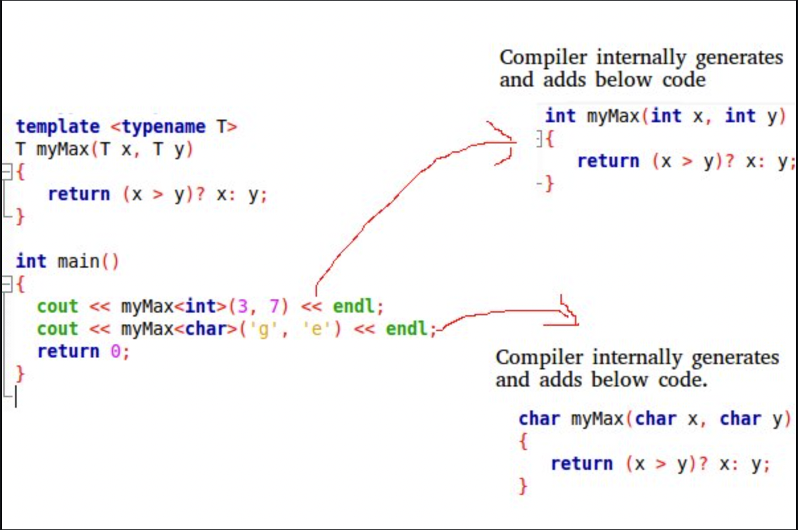

<div style="font-size: 17px;background: black;padding: 2rem;">

Templates are a powerful feature that allows developers to write generic and reusable code. Templates enable functions and classes to operate with generic types, which means that a function or class can work with any data type. This helps in writing more flexible and maintainable code.

C++ adds two new keywords to support templates: <b style="color: Chartreuse;">template</b> and <b style="color: Chartreuse;">typename</b>. The second keyword can always be replaced by the keyword <b style="color: Chartreuse;">class</b>.

Templates are expanded at compiler time. This is like macros. The difference is, that the compiler does type-checking before template expansion. The idea is simple, source code contains only function/class, but compiled code may contain multiple copies of the same function/class. 

<br>

<br>
<br>

There are two primary types of templates in C++:

1. Function Templates
2. Class Templates

<br>

# 1. Function Templates

Function templates define a blueprint for a function that can operate with any data type. This allows the same function to work with different types without being rewritten for each type.

<u><b>Syntax:</b></u>

```c++
template <typename T>
T add(T a, T b) {
    return a + b;
}
```

- <span style="color: HotPink;">template:</span> This keyword indicates the start of a template definition.
- <span style="color: HotPink;">typename T:</span> Specifies that T is a placeholder for any data type. The keyword class can also be used instead of typename.

<u><b>Example Code:</b></u>

```c++
#include <iostream>

template <typename T>
T add(T a, T b) {
    return a + b;
}

int main() {
    int intResult = add(5, 10);         // Calls add<int>(int, int)
    double doubleResult = add(2.5, 3.1); // Calls add<double>(double, double)
    std::cout << "Int result: " << intResult << std::endl;         // Outputs 15
    std::cout << "Double result: " << doubleResult << std::endl;   // Outputs 5.6
    return 0;
}
```

<br>

# 2. Class Templates

Class templates allow the creation of generic classes. A class template defines a family of classes that can work with any data type.

<u><b>Syntax:</b></u>

```c++
template <typename T>
class MyClass {
private:
    T data;
public:
    MyClass(T d) : data(d) {}
    T getData() const { return data; }
};
```

- Similar to function templates, `typename T` specifies that `T` is a placeholder for any data type.

<u><b>Example Code:</b></u>

```c++
#include <iostream>

template <typename T>
class MyClass {
private:
    T data;
public:
    MyClass(T d) : data(d) {}
    T getData() const { return data; }
};

int main() {
    MyClass<int> intObj(10);        // MyClass for int
    MyClass<double> doubleObj(5.5); // MyClass for double

    std::cout << "Int data: " << intObj.getData() << std::endl;       // Outputs 10
    std::cout << "Double data: " << doubleObj.getData() << std::endl; // Outputs 5.5
    return 0;
}
```

Like normal parameters, we can pass more than one data type as arguments to templates. Also we can specify default arguments to templates. The following example demonstrates the same.

```c++
template <class T, class U = char> class A {
    T x;
    U y;

public:
    A() { cout << "Constructor Called" << endl; }
};

int main()
{
    A<char, char> a;
    A<int, double> b;
    return 0;
}
```

</div>

<!-- <div style="font-size: 17px;background: black;padding: 2rem;"> -->
<!-- <div style="background: DarkRed;padding: 0.3rem 0.8rem;"> [HIGHLIGHT] -->
<!-- <h3 style="border-bottom: 2px solid white; padding-bottom: 2px; display: inline-block;"> [SUBHEADING] -->
<!-- <b style="color: Chartreuse;"> [NOTE] -->
<!-- <b style="color:red;"> [NOTE-2] -->
<!-- <span style="color: Cyan;"> [IMP] -></span> -->
<!-- <b style="color: Salmon;"> [POINT] -->
<!-- <div style="border: 1px solid yellow; padding: 10px;"> [BORDER] -->