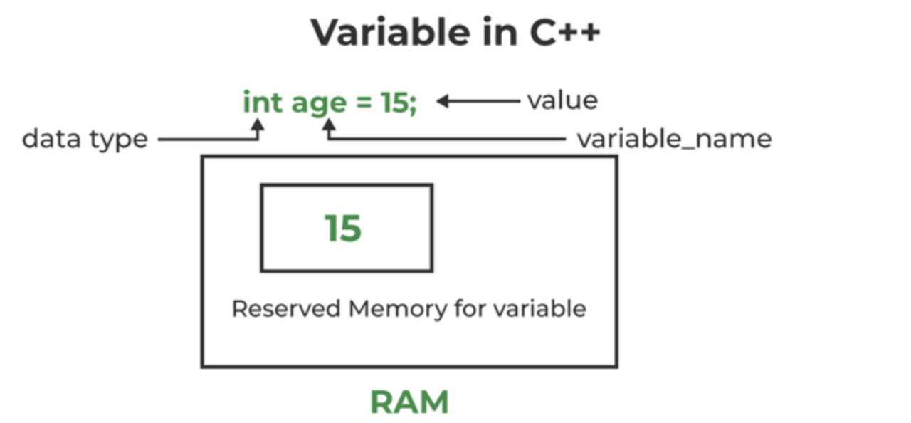

<div style="font-size: 17px;background: black;padding: 2rem;">

Variables in C++ are fundamental components used to store and manipulate data within a program. They represent named memory locations that can hold values of a particular type. The value stored in a variable can be changed during program execution.
A variable is only a name given to a memory location, all the operations done on the variable effects that memory location.
In C++, all the variables must be declared before use.

<b style="color: Salmon;">Declaration:</b> Before using a variable, it must be declared. The declaration specifies the variable's name and its data type. For example:

```c++
int age;
double salary;
char grade;

// In above example: age, salary and grade are variable names and int, double and char are data types
```

<b style="color: Salmon;">Initialization:</b> Variables can be initialized at the time of declaration, which means assigning an initial value to the variable. This is optional but good practice for avoiding undefined behavior:

```c++
int age = 5;
```

<br>

<br>
<br>

<b style="color: Salmon;">Data Type:</b> Data type refers to the type of value a variable has and what type of mathematical, relational or logical operations can be applied without causing an error. C++ has numerous data types like `int` (stores integer values), `char` (stores characters like 'a', 'b', etc), `double`(stores decimal values), etc. and they are covered later.

<b style="color: Salmon;">Scope:</b> The scope of a variable defines where it is accessible within the program. In C++, variables can have block scope (local variables) or file scope (global variables). Variables declared within a block are accessible only within that block (Anything between `{` and `}` is said to inside a block.)

<b style="color: Salmon;">Lifetime:</b> The lifetime of a variable is the duration during which the variable exists in memory. It starts when the variable is created (initialized) and ends when it goes out of scope (is destroyed).

<b style="color: Salmon;">Constants:</b> In addition to variables whose values can change, C++ also supports constants, which are values that cannot be modified once they are assigned. Constants can be declared using the `const` keyword. For example:

```c++
const double PI = 3.14;
```

<br>

# Data Types

All variables use data type during declaration to restrict the type of data to be stored. Therefore, we can say that data types are used to tell the variables the type of data they can store. Whenever a variable is defined in C++, the compiler allocates some memory for that variable based on the data type with which it is declared. Every data type requires a different amount of memory.

Data Types in C++ are Mainly Divided into 3 Types:

1. <b style="color: Salmon;">Primitive Data Types</b>: These data types are built-in or predefined data types and can be used directly by the user to declare variables. For example: `int`, `char`, `float`, `bool`, etc. Primitive data types available in C++ are:

   - <span style="color: Violet;">Integer (int)</span>: Integers typically require `4 bytes` of memory space and range from -2147483648 to 2147483647.
   - <span style="color: Violet;">Character (char)</span>: Character data type is used for storing characters. Characters typically require `1 byte` of memory space and range from -128 to 127 or 0 to 255.
   - <span style="color: Violet;">Boolean (bool)</span>: Boolean data type is used for storing Boolean or logical values. A Boolean variable can store either `true` or `false`.
   - <span style="color: Violet;">Floating Point (float)</span>: Floating Point data type is used for storing single-precision floating-point values or decimal values. Float variables typically require `4 bytes` of memory space.
   - <span style="color: Violet;">Double Floating Point (double)</span>: Double Floating Point data type is used for storing double-precision floating-point values or decimal values. Double variables typically require `8 bytes` of memory space.
   - <span style="color: Violet;">Void (void)</span>: Void means without any value. void data type represents a valueless entity. A void data type is used for those function which does not return a value.
   - <span style="color: Violet;">Wide Character (wchar_t)</span>: Wide character data type is also a character data type but this data type has a size greater than the normal 8-bit data type. It is generally `2 or 4 bytes` long.

2. <b style="color: Salmon;">Derived Data Types</b>: They are derived from the primitive or built-in datatypes. These can be of four types namely - Function, Array, Pointer and Reference.

3. <b style="color: Salmon;">Abstract or User-Defined Data Types</b>: They are defined by the user itself. Like, defining a class in C++ or a structure. C++ provides the following user-defined datatypes: Class, Structure, Union, Enumeration, Typedef defined Datatype.

<h3 style="border-bottom: 2px solid white; padding-bottom: 2px; display: inline-block;">Datatype Modifiers</h3>

Datatype modifiers are used with built-in data types to modify the length of data that a particular data type can hold. Data type modifiers available in C++ are: <b style="color: Violet;">Signed</b>, <b style="color: Violet;">Unsigned</b>, <b style="color: Violet;">Short</b> and <b style="color: Violet;">Long</b>:

<br>

<br>
<br>

<h3 style="border-bottom: 2px solid white; padding-bottom: 2px; display: inline-block;">Type Conversion in C++</h3>

Type conversion in C++ refers to changing the data type of a variable from one type to another. This can be necessary when performing operations between different types or when a specific type is required for a certain function or operation. Type conversion can be categorized into two main types: `implicit` (automatic) conversion and `explicit` (manual) conversion.

- <b style="color: Salmon;">Implicit Type Conversion</b>: It is also known as ‘automatic type conversion’. It is done by the compiler on its own, without any external trigger from the user. It generally takes place when in an expression more than one data type is present. In such condition type conversion (type promotion) takes place to avoid lose of data. All the data types of the variables are upgraded to the data type of the variable with largest data type. It is possible for implicit conversions to lose information, signs can be lost (when signed is implicitly converted to unsigned), and overflow can occur (when long long is implicitly converted to float).

    ```c++
    // An example of implicit conversion

    #include <iostream>
    using namespace std;

    int main()
    {
        int x = 10; // integer x
        char y = 'a'; // character c

        x = x + y; // y implicitly converted to int (ASCII).  value of 'a' is 97
        
        float z = x + 1.0; // x is implicitly converted to float

        cout << "x = " << x << endl << "y = " << y << endl << "z = " << z << endl;

        return 0;
    }
    ```

- <b style="color: Salmon;">Explicit Type Conversion</b>: This process is also called type casting and it is user-defined. Here the user can typecast the result to make it of a particular data type. In C++, it can be done by two ways:

    - <i>Converting by assignment:</i> This is done by explicitly defining the required type in front of the expression in parenthesis. This can be also considered as forceful casting.

        ```c++
        double x = 1.2;
        int sum = (int)x + 1; // Explicit conversion from double to int. sum = 2
        ```
    - <i>Conversion using Cast operator:</i> A Cast operator is an unary operator which forces one data type to be converted into another data type. C++ supports four types of casting: `Static Cast`, `Dynamic Cast`, `Const Cast` and `Reinterpret Cast`. 

<div style="border: 3px solid Violet; padding: 10px;">

To calculate average of 2 `int` variables and store them in deciamal (floating-point-number), we need to cast at least one of the integers to a floating-point type (such as `float` or `double`) before performing the division. This ensures that the division is carried out in floating-point arithmetic, rather than integer arithmetic.

```c++
int a = 5, b = 10;
float average = ((float)a + b) / 2;
```

</div>

</div>

<!-- <div style="font-size: 17px;background: black;padding: 2rem;"> -->
<!-- <div style="background: DarkRed;padding: 0.3rem 0.8rem;"> [HIGHLIGHT] -->
<!-- <h3 style="border-bottom: 2px solid white; padding-bottom: 2px; display: inline-block;"> [SUBHEADING] -->
<!-- <b style="color: Chartreuse;"> [NOTE] -->
<!-- <b style="color:red;"> [NOTE-2] -->
<!-- <span style="color: Cyan;"> [IMP] -></span> -->
<!-- <b style="color: Salmon;"> [POINT] -->
<!-- <div style="border: 1px solid yellow; padding: 10px;"> [BORDER] -->
